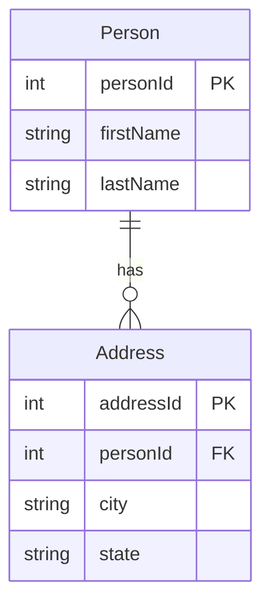

# [leetcode : 175. Combine Two Table](https://leetcode.com/problems/combine-two-tables/)

## **다이어그램**



## **목표**

> Write a solution to `report the first name, last name, city, and state of each person` in the Person table. `If the address of a personId is not present in the Address table, report null instead.`
> `두 테이블을 조인해서 personId의 주소지 정보를 가져오기. (없으면 NULL)`

## **문제 풀이**

회원 정보와 거래 정보같이, 모든 데이터가 들어있는 테이블과 회원의 일부만 들어있는 테이블이 있을 때 피벗 테이블을 기준으로 Left Join을 사용한다.
이 문제에서는 피벗 테이블인 `Person` 테이블을 기준으로 Address 테이블을 `LEFT JOIN`한다.

### **MySQL**

[tabs: Solution 1]

```sql
-- SOLUTION 1: LEFT JOIN
SELECT
    p.firstName,
    p.lastName,
    a.city,
    a.state
FROM
    person p
LEFT JOIN
    address a ON p.personid = a.personid
```

[/tabs]

* SOLUTION 1
  * PERSON 테이블에 사람 정보가 있으면 Address 테이블에는 사람 정보가 없어도 가져와야한다.
  * LEFT JOIN으로 가져오기.

### **Pandas**

[tabs: Solution 1]

```python
# SOLUTION 1: merge + left
import pandas as pd

def combine_two_tables(person: pd.DataFrame, address: pd.DataFrame) -> pd.DataFrame:
    # 모든 정보가 들어있는 Person이 기준 테이블이므로, left join을 사용
    joined = pd.merge(person, address, on='personId', how='left')
    cols = ['firstName', 'lastName', 'city', 'state']
    return joined.loc[:, cols]
```

[/tabs]

* SOLUTION 1
  * PERSON 테이블에 사람 정보가 있으면 Address 테이블에는 사람 정보가 없어도 가져와야한다.
  * 재사용을 위해서 가져오기 columns를 따로 정의해주기.
  * pd.merge가 아니라 person.merge를 사용해서도 새로운 데이터프레임을 생성할 수 있다.

## **코멘트**

* 항상 기준 테이블을 기준으로 `LEFT JOIN`하는 문제가 많이 나온다.
* LEFT JOIN을 하게되면, 필연적으로 `NULL` 데이터가 나오므로 `COALESCE`를 사용하여 `NULL` 값을 처리하자.
