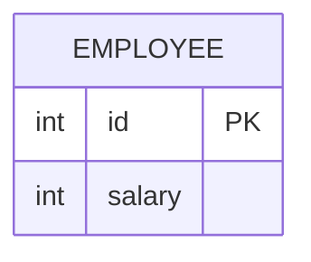

# [leetcode : 176. Second Highest Salary](https://leetcode.com/problems/second-highest-salary/)

## **다이어그램**



## **목표**

> Write a solution to `find the second highest distinct salary` from the Employee table. `If there is no second highest salary, return null (return None in Pandas).`
> `두 번째로 높은 고유 급여 구하기 (없으면 NULL)`

## **문제 풀이**

### **MySQL**

[tabs: Solution 1, Solution 2, Solution 3, Solution 4]

```sql
-- SOLUTION 1 : DENSE_RANK + SUBQUERY
WITH SALARY_ORDER AS (
    SELECT
        ID,
        SALARY,
        DENSE_RANK() OVER (ORDER BY SALARY DESC) AS RN
    FROM EMPLOYEE
)

SELECT (
    SELECT
        DISTINCT SALARY 
    FROM
        SALARY_ORDER 
    WHERE
        RN = 2
) AS SecondHighestSalary;
```

```sql
-- SOLUTION 2 : DENSE_RANK + MAX
WITH SALARY_ORDER AS (
    SELECT
        ID,
        SALARY,
        DENSE_RANK() OVER (ORDER BY SALARY DESC) AS RN
    FROM EMPLOYEE
)

SELECT
    MAX(SALARY) AS SecondHighestSalary
FROM
    SALARY_ORDER
WHERE
    RN = 2;
```

```sql
-- SOLUTION 3: 내 풀이
WITH SALARY_RANKING AS (
    SELECT 
        SALARY,
        ROW_NUMBER() OVER (ORDER BY SALARY DESC) AS IDX
    FROM
        (SELECT DISTINCT SALARY FROM EMPLOYEE) SUB
)
SELECT 
    COALESCE((SELECT SALARY FROM SALARY_RANKING WHERE IDX = 2), NULL) AS SecondHighestSalary;
```

```sql
-- SOLUTION 4: 빠른 풀이
WITH salary_rnk as (
    SELECT *, DENSE_RANK() OVER (order by salary DESC) as rnk
    FROM Employee)

SELECT ( SELECT salary FROM salary_rnk WHERE rnk=2 LIMIT 1) as SecondHighestSalary
```

[/tabs]

* SOLUTION 1 : DENSE_RANK + SUBQUERY

  * 스칼라 서브쿼리를 사용하는 경우, 불러올 값이 없는 경우에 자동으로 `NULL`을 반환한다.
  * 중복된 연봉을 처리하기 위해 `DENSE_RANK()` 또는 `LIMIT`를 사용하여 처리한다.
  
* SOLUTION 2 : DENSE_RANK + MAX
  
  * 집계 함수를 사용하는 경우에 값이 없는 경우 `NULL`을 반환한다.
  * 집계 함수에서 중복된 연봉을 처리할 수 있고, `NULL`값도 자동으로 반환이 가능하다.

* SOLUTION 3: ROWNUMBER + CTE를 사용.
  * CTE를 사용해서 서브쿼리처럼 안에 반환값이 없는경우 null을 받을 수 없기 때문에 쿼리를 한 번 더 돌려서 복잡도가 올라갔다.
  
* SOLUTION 4: DENSE RANK + SUBQUERY
  * DISTINCT + ROW_NUMBER 대신, DENSE_RANK를 사용해서 고유값만 사용하기.
  * SELECT + 서브쿼리 구문에서 없으면 null 반환이라 따로 COALESCE를 사용할 필요가 없다.
  * 1번이랑 같은 풀이!
  
### **Pandas**

[tabs: Solution 1, Solution 2, Solution 3, Solution 4, Solution 5]

```python
# SOLUTION 1
import pandas as pd

def second_highest_salary(employee: pd.DataFrame) -> pd.DataFrame:

    # unique_salaries = employee[['salary']].drop_duplicates().sort_values(by='salary',ascending=False)
    # 데이터 프레임의 경우에는 by로 지정을 해야한다.

    unique_salaries = employee['salary'].drop_duplicates().sort_values(ascending=False)

    second_val = unique_salaries.iloc[1:2].max()
    
    return pd.DataFrame({'SecondHighestSalary': [second_val]})
```

```python
# SOLUTION 2
def second_highest_salary(employee: pd.DataFrame) -> pd.DataFrame:
    salary_dense_rank = pd.DataFrame({'salary':
                                    sorted(employee['salary'].unique(),reverse=True)})

    if len(salary_dense_rank) < 2:
        answer = None
    else:
        answer = salary_dense_rank['salary'].iloc[1]

    return pd.DataFrame({'SecondHighestSalary': [answer]})
```

```python
# SOLUTION 3: dense rank
import pandas as pd

def second_highest_salary(employee: pd.DataFrame) -> pd.DataFrame:
    employee['salary_dense_rank'] = employee['salary'].rank(method='dense', ascending=False)
    second_highest = employee[employee['salary_dense_rank'] == 2]['salary']
    if second_highest.empty:
        answer = None
    else:
        answer = second_highest.iloc[0]
    
    return pd.DataFrame({'SecondHighestSalary': [answer]})
```

```python
# SOLUTION 4: sort values
import pandas as pd

def second_highest_salary(employee: pd.DataFrame) -> pd.DataFrame:
    df = employee.copy()
    df = df.drop_duplicates(subset='salary').sort_values('salary', ascending=False)
    if len(df) >=2:
        df = df.iloc[1]['salary']
        return pd.DataFrame(data=[df], columns=['SecondHighestSalary'])
    else:
        return pd.DataFrame(data=[None], columns=['SecondHighestSalary'])
```

```python
# SOLUTION 5: drop duplicate + nlargest
import pandas as pd

def second_highest_salary(employee: pd.DataFrame) -> pd.DataFrame:
    unique_salaries = employee['salary'].drop_duplicates()
    if len(unique_salaries) < 2:
        answer = None
    else:
        answer = unique_salaries.nlargest(2).iloc[-1]
    
    return pd.DataFrame({'SecondHighestSalary': [answer]})
```

[/tabs]

* SOLUTION 1
  * 고유한 샐러리 값을 뽑아낸다.
  * `iloc`로 접근하는 경우, 인덱스 에러가 발생할 수 있으므로, 슬라이싱을 사용한다.
  * 슬라이싱의 값이 없을 수 있으므로 `max()`를 통해서 NaN값을 처리한다.

* SOLUTION 2: sorted
  * Pandas의 `unique()` 메소드를 사용하여 고유한 값을 추출한다.
  * Python 내장 함수인 `sorted()`를 사용하여 역순으로 정렬한다.
  * 리스트의 길이가 2보다 작은 경우(두 번째 값이 없는 경우) `None`을, 그렇지 않으면 인덱스 1의 값을 반환한다.

* SOLUTION 3: dense rank
  * `rank(method='dense')`를 사용하여 동점자 처리 시 순위를 건너뛰지 않고 매긴다 (예: 1등, 1등, 2등).
  * 랭크가 2인 행을 필터링하여 값을 가져온다.
  * 값이 없는 경우 에러가 발생하지 않도록 예외 처리가 필요하다.

* SOLUTION 4: sort values
  * `drop_duplicates()`와 `sort_values()`를 체이닝하여 정렬한다.
  * 데이터프레임의 크기를 확인하여 두 번째 값이 존재하는지 체크한다.
  * 가장 직관적이고 널리 쓰이는 Pandas 풀이 방식이다.

* SOLUTION 5: drop duplicate + nlargest
  * `nlargest(n)` 메소드는 상위 n개의 값을 효율적으로 찾아낸다.
  * `unique()`로 중복을 제거한 후 상위 2개를 뽑고, 그 중 마지막 값(`iloc[-1]`)을 선택하면 두 번째로 큰 값이 된다.
  * 전체 정렬을 하지 않고 Top K만 구하므로 이론적으로 가장 빠를 수 있다 ($O(N + K \log K)$).

## **코멘트**

* 시간 복잡도는 똑같은데 한참 느려서 여러 번 풀었음
