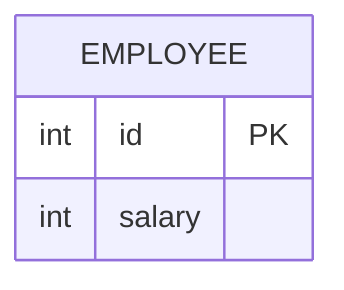

# [leetcode : 177. Nth Highest Salary](https://leetcode.com/problems/nth-highest-salary/description/)

## **다이어그램**



## **목표**

> Write a solution to `find the nth highest salary from the Employee table. If there is no nth highest salary, return null.`
> `N번째로 높은 급여 구하기 (없으면 NULL)`

## **문제 풀이**

### **MySQL**

[tabs: Solution 1, Solution 2]

```sql
CREATE FUNCTION getNthHighestSalary(N INT) RETURNS INT
BEGIN
    DECLARE result INT;

    WITH TEMP AS (
        SELECT SALARY, DENSE_RANK() OVER (ORDER BY SALARY DESC) AS DENSE_RANKING
        FROM EMPLOYEE
    )
    SELECT SALARY INTO result
    FROM TEMP
    WHERE DENSE_RANKING = N
    LIMIT 1;

    RETURN result;
END
```

```sql
CREATE FUNCTION getNthHighestSalary(N INT) RETURNS INT
BEGIN
  DECLARE M INT;
  SET M = N - 1;

  RETURN (
      SELECT DISTINCT salary
      FROM Employee
      ORDER BY salary DESC
      LIMIT 1 OFFSET M
  );
END
```

[/tabs]

* SOLUTION 1
  * 함수 선언하는 형태가 익숙하진 않은데, 안쪽에서 쿼리만 작성해주면 된다.
  * DENSE RANK + LIMIT (LIMIT를 사용해야 값이 없어도 null 처리를 해준다.)

* SOLUTION 2
  * 마찬가지로, 리턴에 스칼라 서브쿼리를 날려주면 데이터가 없으면 `NULL`을 반환한다.

### **Pandas**

[tabs: Solution 1, Solution 2]

```python
import pandas as pd

def nth_highest_salary(employee: pd.DataFrame, N: int) -> pd.DataFrame:
    unique_salaries = employee['salary'].drop_duplicates()
    top_n_salaries = unique_salaries.nlargest(N)

    if len(top_n_salaries) < N:
        answer = None
    else:
        top_n_salaries = unique_salaries.nlargest(N)
        if N>0:
            answer = top_n_salaries.iloc[N-1]
        else:
            answer = None
    
    return pd.DataFrame({f'getNthHighestSalary({N})': [answer]})
```

```python
import pandas as pd

def get_nth_highest_salary(employee: pd.DataFrame, N: int) -> pd.DataFrame:
    if N <= 0:
        return pd.DataFrame({f'getNthHighestSalary({N})': [None]})

    unique_salaries = employee['salary'].drop_duplicates().sort_values(ascending=False)

    nth_val = unique_salaries.iloc[N-1 : N].max()
    
    return pd.DataFrame({f'getNthHighestSalary({N})': [nth_val]})
```

[/tabs]

* SOLUTION 1
  * 중복 제거 후, 상위 N개 뽑기
  * N개보다 작거나, N에 양수가 아닌 값이 들어오면 예외처리 `None`

* SOLUTION 2
  * `drop_duplicates`와 `sort_values`를 이용해 정렬
  * `iloc` 슬라이싱과 `max()`를 사용하여 빈 리스트일 경우 `NaN` 처리를 자연스럽게 유도
  
## **코멘트**

* SQL 함수 작성 받법은 알아두기
