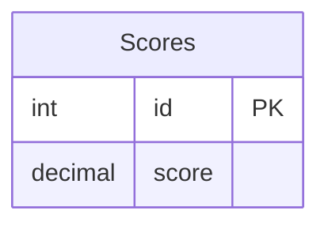

# [leetcode : 178. Rank Scores](https://leetcode.com/problems/rank-scores/description/)

## **다이어그램**



## **목표**

> Write a solution to `find the rank of the scores`. The ranking should be calculated according to the following rules:
> - The scores should be ranked from the highest to the lowest.
> - `If there is a tie between two scores, both should have the same ranking.`
> - After a tie, the next ranking number should be the next consecutive integer value. In other words, there should be no holes between ranks.
> `동일 점수는 같은 등수로 취급해서 점수 내림차순으로 점수랑 랭킹 반환하기`

## **문제 풀이**

### **MySQL**

[tabs: Solution 1]

```sql
-- SOLUTION 1: DENSE_RANK
SELECT
    SCORE,
    DENSE_RANK() OVER (ORDER BY SCORE DESC) AS `RANK`
FROM 
    SCORES
```

[/tabs]

* SOLUTION 1
  * 기본적인 DENSE_RANK() 사용법을 묻는 문제.

### **Pandas**

[tabs: Solution 1]

```python
# SOLUTION 1: rank + dense
import pandas as pd

def order_scores(scores: pd.DataFrame) -> pd.DataFrame:
    scores = scores.copy()
    scores['rank'] = scores['score'].rank(method='dense', ascending=False)
    return scores.loc[:, ['score','rank']].sort_values('rank')
```

[/tabs]

* SOLUTION 1
  * rank(method='dense') + sort_values

## **코멘트**

* `ROW_NUMBER()`, `DENSE_RANK()`, `RANK()`의 차이를 잘 알고 넘어가기
* 파이썬에서는 `ROW_NUMBER()` 대신 `cumcount()`를 사용할 수 있다.
* rank(method="min, max") 등 동점자를 어떻게 처리하는지 설정이 가능하다.
