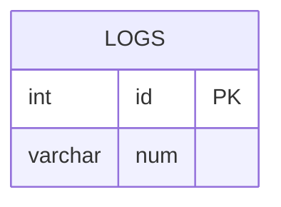

# [leetcode : 180. Consecutive Numbers](https://leetcode.com/problems/consecutive-numbers/)

## **다이어그램**



## **목표**

> Find `all numbers that appear at least three times consecutively.`
> `연속 3개 이상 나오는 숫자들 구하기 (ID는 AUTO INC)`

## **문제 풀이**

### **MySQL**

[tabs: Solution 1, Solution 2]

```sql
WITH TEMP AS (
    SELECT
        NUM,
        MIN(NUM) OVER (ORDER BY ID ROWS BETWEEN 2 PRECEDING AND CURRENT ROW) AS MIN_WINDOW,
        MAX(NUM) OVER (ORDER BY ID ROWS BETWEEN 2 PRECEDING AND CURRENT ROW) AS MAX_WINDOW,
        COUNT(NUM) OVER (ORDER BY ID ROWS BETWEEN 2 PRECEDING AND CURRENT ROW) AS CNT
    FROM
        LOGS
)
SELECT
    DISTINCT(NUM) AS ConsecutiveNums 
FROM
    TEMP
WHERE
    MIN_WINDOW = MAX_WINDOW AND CNT = 3;
```

```sql
WITH TEMP AS (
    SELECT
        NUM,
        LAG(NUM,1) OVER (ORDER BY ID) AS PREV_NUM,
        LEAD(NUM,1) OVER (ORDER BY ID) AS NEXT_NUM
    FROM
        LOGS
)
SELECT
    DISTINCT NUM AS ConsecutiveNums
FROM
    TEMP
WHERE
    NUM = PREV_NUM AND NUM = NEXT_NUM;
```

[/tabs]

* SOLUTION 1 : WINDOW + MIN/MAX
  * 크기 3 윈도우에서 MIN MAX값이 같고, 크기 3이 만족이 되면 (테이블 양 끝쪽이 아니면) 출력하기.
  
* SOLUTION 2 : LEAD / LAG
  * LEAD LAG로로 주변 값 1개씩 비교하기.

### **Pandas**

[tabs: Solution 1, Solution 2, Solution 3]

```python
def consecutive_numbers(logs: pd.DataFrame) -> pd.DataFrame:
    logs['window_max'] = logs['num'].rolling(window=3).max()
    logs['window_min'] = logs['num'].rolling(window=3).min()
    cond1 = logs['window_min'] == logs['window_max']
    return logs[cond1][['num']].drop_duplicates('num').rename(columns={'num':'ConsecutiveNums'})
```

```python
def consecutive_numbers(logs: pd.DataFrame) -> pd.DataFrame:
    logs['prev_num'] = logs['num'].shift(1)
    logs['next_num'] = logs['num'].shift(-1)

    cond1 = logs['num']==logs['prev_num']
    cond2 = logs['num']==logs['next_num']
    return logs[cond1&cond2][['num']].drop_duplicates('num').rename(columns={'num':'ConsecutiveNums'})
```

```python
def consecutive_numbers(logs: pd.DataFrame) -> pd.DataFrame:
    logs['unique_count'] = logs['num'].rolling(window=3).apply(lambda x: len(set(x)))
    answer = (logs.loc[logs['unique_count'] == 1, ['num']]
                    .drop_duplicates()
                    .rename(columns={'num': 'ConsecutiveNums'}))
    return answer
```

[/tabs]

* SOLUTION 1 : rolling + min/max
  * 크기 3 윈도우에서 MIN MAX값이 같고, 크기 3이 만족이 되면 (테이블 양 끝쪽이 아니면) 출력하기.
  
* SOLUTION 2 : shift
  * shift가 양수면 위에서 아래로 푸시 해줘서 값이 밀려나는 것으로 생각하면 된다.
  * shift(1)이면 첫 줄에는 none

* SOLUTION 3 : rolling + apply(set)
  * `rolling(window=3)`에 `set`을 적용해 고유값 개수가 1개인 경우(즉, 3개가 모두 같은 값인 경우)를 필터링.
  * rolling에서 첫 행같은 경우 컬럼에 값이 비어있는 경우가 발생하는데, 이 때 NaN으로 인해 결과값이 NaN이 된다.

## **코멘트**

* 윈도우 함수 정리하기!

* pandas에서 조건의 경우 시리즈로 선언하기.

* 조건을 적용하는 경우에는 `.loc[행 조건, 열 선택]`을 사용해서 명확하게 풀이하자.
