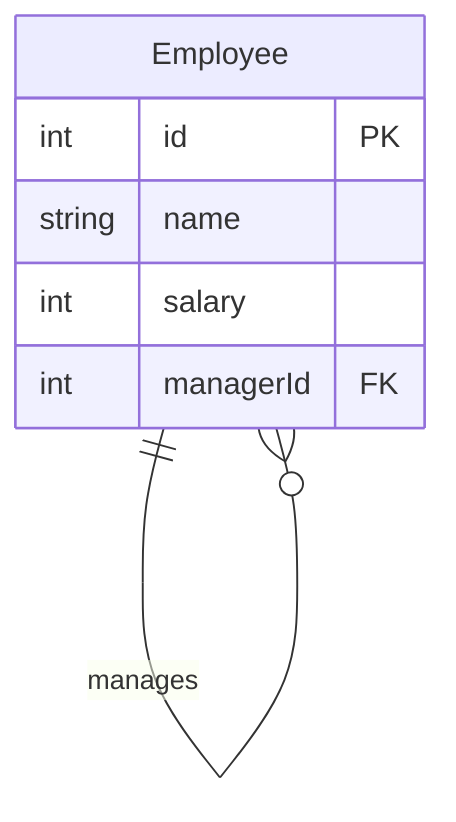

# [leetcode : 181. Employees Earning More Than Their Managers](https://leetcode.com/problems/employees-earning-more-than-their-managers/description/)

## **다이어그램**



## **목표**

> Write a solution to `find the employees who earn more than their managers.`
> `매니저보다 돈 많이 버는 사원 이름 출력하기`

## **문제 풀이**

### **MySQL**

[tabs: Solution 1, Solution 2, Solution 3]

```sql
WITH IS_NOT_MANAGER AS (
    SELECT
        *
    FROM 
        Employee
    WHERE
        managerId IS NOT NULL
)

SELECT
    i.name as Employee
FROM
    IS_NOT_MANAGER i
JOIN
    Employee e ON e.id = i.managerId
WHERE
    e.salary < i.salary
```

```sql
SELECT e1.name as Employee
FROM Employee e1
JOIN Employee e2 ON e1.managerId = e2.id
WHERE e1.salary > e2.salary
```

```sql
select e1.name as Employee from Employee e1, Employee e2
where e1.managerId = e2.id
and e1.salary > e2.salary
```

[/tabs]

* 어짜피 self join 과정에서 null 데이터는 조인이 안돼서 굳이 cte를 작성할 필요는 없었다.

* self join 사용 시, sol3 보다는 sol2처럼 명시적으로 JOIN을 사용해서 가독성 높이기.
  
### **Pandas**

[tabs: Solution 1, Solution 2]

```python
import pandas as pd

def find_employees(employee: pd.DataFrame) -> pd.DataFrame:

    joined = pd.merge(employee, employee,
                    how='inner',
                     left_on='managerId', right_on='id',
                     suffixes=('_employee', '_manager'))
    
    cond = joined['salary_employee'] > joined['salary_manager']
    
    return joined[cond][['name_employee']].rename(columns={'name_employee': 'Employee'})
```

```python
def find_employees(employee: pd.DataFrame) -> pd.DataFrame:
    joined = pd.merge(employee, employee,
                    how='left', left_on='managerId', right_on='id',
                    suffixes=('_employee', '_manager'))
    
    cond = joined['salary_employee'] > joined['salary_manager']
    
    return joined.loc[cond, ['name_employee']].rename(columns={'name_employee': 'Employee'})
```

[/tabs]

* 조인 컬럼명이 달라서 left right on을 사용한다.

* 기준 테이블을 명시하기 위해 suffixes를 사용한다.

* 조건 같은경우 재사용이 가능하게 변수에 할당한다.
  * 명명 규칙도 정하면 좋을듯..

* rename을 통해서 변경 컬럼명 전달해주기.

* `Solution 2`에서는 `.loc[행 조건, 열 선택]`을 사용하여 더 명확하게 인덱싱을 수행한다.
  
## **코멘트**

* pandas에서 self join으로 안풀어도 되는데, left/right를 쓰는 경우 null값을 거르지 못하기 때문에 성능상으로 나쁘다.

* 셀프조인에서는 null값이 바로 걸러지기 때문에 .loc 조건 절에서 기존 테이블의 크기보다 작은 테이블을 순회한다.
