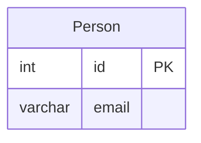

# [leetcode : 182. Duplicate Emails](https://leetcode.com/problems/duplicate-emails/description/)

## **다이어그램**



## **목표**

> Write a solution to `report all the duplicate emails.` Note that it's guaranteed that the email field is not NULL.
> `중복된 이메일 찾기`

## **문제 풀이**

### **MySQL**

[tabs: Solution 1]

```sql
-- SOLUTION 1: GROUP BY + HAVING
SELECT
    EMAIL AS `Email`
FROM
    PERSON
GROUP BY
    EMAIL
HAVING
    COUNT(EMAIL) > 1
```

[/tabs]

* SOLUTION 1
  * GROUP BY + HAVING
  
### **Pandas**

[tabs: Solution 1, Solution 2]

```python
import pandas as pd

def duplicate_emails(person: pd.DataFrame) -> pd.DataFrame:
    email_count = (pd.DataFrame(person['email']
                    .value_counts())
                    .reset_index(names=['Email','count']))
    cond = email_count['count'] > 1
    return email_count.loc[cond,['Email']]
```

```python
import pandas as pd

def duplicate_emails(person: pd.DataFrame) -> pd.DataFrame:
    grouped = person.groupby(by='email', as_index=True).agg(
        count=('email', 'count')
    ).reset_index()
    
    is_duplicate = grouped['count'] > 1
    
    result = grouped.loc[is_duplicate, ['email']]
    result.columns = result.columns.str.capitalize()
    
    return result
```

[/tabs]

* SOLUTION 1
  * 기준 이메일도 반환하기 위해서 `reset_index` 사용.
  * 반환된 시리즈를 데이터프레임으로 만들어서 바로 `reset_index`의 `names`로 컬럼명을 지정하는 방식이 효율적이다.

* SOLUTION 2
  * `groupby` 시 `as_index=False`를 선언하거나, 혹은 기본값인 `True`일 경우 `reset_index()`를 호출하여 인덱스를 컬럼으로 넘겨주는 방식 중 선택하여 사용할 수 있다.
  
## **코멘트**

* pandas에서 중복 데이터를 처리하는 방법은 많으니 기억하기.
