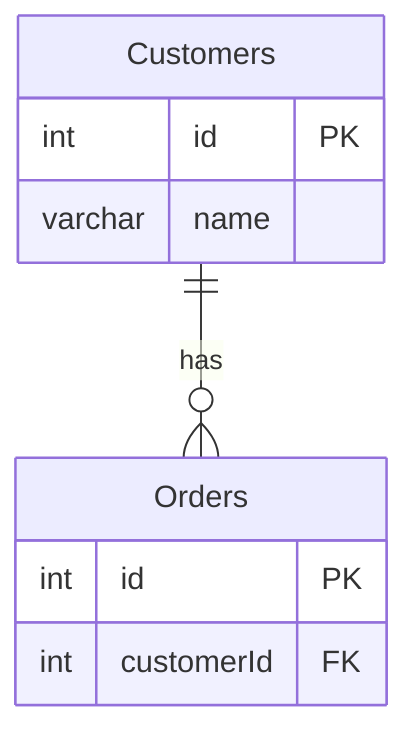

# [leetcode : 183. Customers Who Never Order](https://leetcode.com/problems/customers-who-never-order/description/)

## **다이어그램**



## **목표**

> Write a solution to `find all customers who never order anything.`
> `주문하지 않은 고객 찾기`

## **문제 풀이**

### **MySQL**

[tabs: Solution 1, Solution 2, Solution 3]

```sql
SELECT
    NAME AS CUSTOMERS
FROM
    CUSTOMERS C
LEFT JOIN
    ORDERS O ON C.ID = O.CUSTOMERID
WHERE
    O.CUSTOMERID IS NULL
```

```sql
SELECT
    NAME AS CUSTOMERS
FROM
    CUSTOMERS
WHERE
    ID NOT IN (SELECT CUSTOMERID FROM ORDERS)
```

```sql
SELECT
    NAME as Customers
FROM
    CUSTOMERS C
WHERE
    NOT EXISTS (SELECT 1 FROM ORDERS O WHERE C.ID = O.CUSTOMERID)
```

[/tabs]

* SOLUTION 1
  * LEFT JOIN을 사용하면, CUSTOMER ID가 있는 사람 아닌 사람이 NULL로 구분이 된다.

* SOLUTION 2
  * ID가 CUSTOMERID에 있는지 확인

* SOLUTION 3
  * 메모리 오버헤드가 적은 NOT EXISTS
  * 내부적으로는 semi join 형식으로 진행이 된다고 한다.
  * 해당 아이템이 존재하는지 B-tree index를 타고 내려가서 하나라도 존재하면 탈출한다.
  * 물리적으로 테이블을 합치는 JOIN보다 효율적이다.
  * 아이템 하나하나 B-tree index를 타는게 비효율적인 경우 Hash Join도 사용한다고 한다.

### **Pandas**

[tabs: Solution 1, Solution 2]

```python
# SOLUTION 1: merge left + isnull
import pandas as pd

def find_customers(customers: pd.DataFrame, orders: pd.DataFrame) -> pd.DataFrame:
    join = pd.merge(customers, orders,
                    left_on='id', right_on='customerId', how='left')
    is_never_ordered = join['customerId'].isnull()
    return join.loc[is_never_ordered, ['name']].rename(columns={'name':'Customers'})
```

```python
# SOLUTION 2: isin
import pandas as pd

def find_customers(customers: pd.DataFrame, orders: pd.DataFrame) -> pd.DataFrame:
    is_ordered = customers['id'].isin(orders['customerId'])
    answer = customers.loc[~is_ordered, ['name']]
    answer.rename(columns={'name': 'Customers'}, inplace=True)
    return answer
```

[/tabs]

* SOLUTION 1
  * NULL값을 찾을 때 isnull()을 사용하기

* SOLUTION 2
  * ~을 통해서 불리언 인덱스들을 반전시킨다.
  
## **코멘트**

* 풀이가 같은데도 동작시간이 좀 차이가 나는듯?