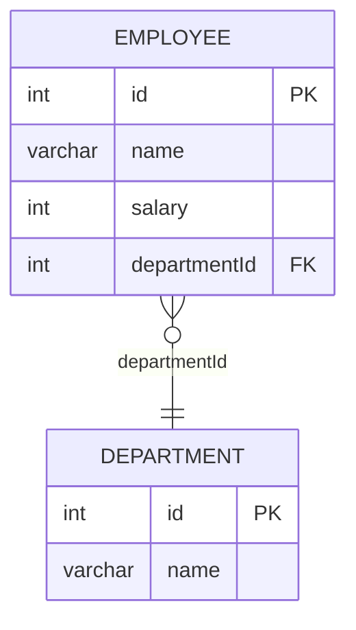

# [leetcode : 184. Department Highest Salary](https://leetcode.com/problems/department-highest-salary/description/)

## **다이어그램**



## **목표**

> Write a solution to `find employees who have the highest salary in each of the departments.`
> `부서마다 연봉 1위인 사원 조회하기`

## **문제 풀이**

### **MySQL**

[tabs: Solution 1, Solution 2, Solution 3]

```sql
WITH TEMP AS (
    SELECT
        *,
        DENSE_RANK() OVER (PARTITION BY DEPARTMENTID ORDER BY SALARY DESC) AS SALARY_RANK
    FROM EMPLOYEE
)

SELECT
    D.NAME AS DEPARTMENT,
    T.NAME AS EMPLOYEE,
    T.SALARY AS SALARY
FROM
    TEMP T
JOIN
    DEPARTMENT D ON T.DEPARTMENTID = D.ID
WHERE
    T.SALARY_RANK = 1
```

```sql
WITH MAX_SALARY_DEPARTMENT AS (
    SELECT
        DEPARTMENTID,
        NAME,
        MAX(SALARY) AS MAX_SALARY
    FROM
        EMPLOYEE
    GROUP BY
        DEPARTMENTID
)

SELECT
    D.NAME AS Department,
    E.NAME AS Employee,
    MSD.MAX_SALARY AS Salary
FROM
    MAX_SALARY_DEPARTMENT AS MSD
LEFT JOIN
    EMPLOYEE AS E
    ON MSD.DEPARTMENTID = E.DEPARTMENTID
    AND MSD.MAX_SALARY = E.SALARY
JOIN
    DEPARTMENT AS D
    ON D.ID = E.DEPARTMENTID
```

```sql
WITH SALARY_RANK AS (
    SELECT
        D.NAME AS Department,
        E.NAME AS Employee,
        DENSE_RANK() OVER(PARTITION BY D.ID ORDER BY E.SALARY DESC) AS rk,
        E.SALARY AS Salary
    FROM
        EMPLOYEE AS E
    JOIN
        DEPARTMENT AS D
        ON E.DEPARTMENTID = D.ID
)

SELECT
    Department,
    Employee,
    Salary
FROM
    SALARY_RANK
WHERE
    RK = 1
```

[/tabs]

* SOLUTION 1: DENSE_RANK + JOIN
  * 각 부서별로 DENSE RANK를 구한 후, 1등인 사람들만 JOIN으로 조회
  * PARTITION BY가 ORDER BY보다 먼저 와야한다.
  
* SOLUTION 2: GROUP BY + MAX
  * GROUP BY로 각 부서별로 MAX값을 구한 후, MAX값과 일치하는 사람들만 조회

* SOLUTION 3: RANK + JOIN
  * JOIN을 먼저 수행한 뒤 RANK를 매기는 방식. 로직은 Solution 1과 유사함.

### **Pandas**

[tabs: Solution 1, Solution 2, Solution 3]

```python
def department_highest_salary(employee: pd.DataFrame, department: pd.DataFrame) -> pd.DataFrame:
    employee['rank'] = (employee.groupby('departmentId')['salary']
                            .rank(method='dense', ascending=False))

    high_salary_employee = employee[employee['rank'] == 1]

    answer = pd.merge(high_salary_employee, department,
                          left_on='departmentId', right_on='id',
                          suffixes=('_high_salary_employee', '_department'))

    answer.rename(columns = {'name_department':'Department',
                              'name_high_salary_employee':'Employee',
                              'salary':'Salary'},
                              inplace=True)

    return answer[['Department','Employee','Salary']]
```

```python
def department_highest_salary(employee: pd.DataFrame, department: pd.DataFrame) -> pd.DataFrame:
    employee = employee.sort_values(['departmentId', 'salary'], ascending=[True, False])

    top_salary = (employee[['salary', 'departmentId']]
                      .drop_duplicates(subset=['departmentId'], keep='first'))

    cond = (employee[['salary', 'departmentId']]
                .apply(tuple, axis=1)
                .isin(top_salary.apply(tuple,axis=1))
            )
            
    top_salary_emp = employee[cond]

    answer = pd.merge(top_salary_emp, department,
                        left_on='departmentId',right_on='id',how='left')
                        
    return answer[['name_y','name_x','salary']].rename(columns={'name_y':'Department',
                                                                'name_x':'Employee',
                                                                'salary':'Salary'})
```

```python
import pandas as pd

def department_highest_salary(employee: pd.DataFrame, department: pd.DataFrame) -> pd.DataFrame:

    joined = pd.merge(employee, department,
                      left_on='departmentId', right_on='id',
                      suffixes=('_emp','_dep')
    )

    joined['salary_rank'] = joined.groupby('name_dep')['salary'].rank(method='dense', ascending=False)

    rank_top = joined['salary_rank'] == 1
    answer = joined.loc[rank_top, ['name_dep','name_emp','salary']]
    answer.columns = ['Department', 'Employee', 'Salary']

    return answer
```

[/tabs]

* SOLUTION 1
  * dense rank로 등수를 매겨준 뒤 1등인 사람을 찾고 join.

* SOLUTION 2
  * 각 부서에서 1등인 사람들만 모아놓으면, 테이블 크기가 충분히 줄어들어서 isin도 효과적으로 작동할 것이라고 생각했음.
  * 데이터 프레임끼리 비교가 아니라, 내부 레코드끼리 비교라서 apply tuple로 각 row를 튜플로 만들어야함.
  * solution 1보다 빠르게 작동함.

* SOLUTION 3
  * 먼저 JOIN을 수행한 뒤, 부서 이름으로 그룹화하여 랭크를 매기는 방식.

## **코멘트**

* pandas에서 nlargest로 뽑아내거나, groupby + max로 뽑는 등 다양한 접근이 가능하다.

* 기본적으로 조인을 진행 한 후에 랭크 연산을 하는 방식은 효율적이지 못한 것 같다.
  * 기존의 작은 테이블에서 미리 랭킹 테이블을 만들어놓고 조인하는 방식이 더 효율적인 것 같다.

* inplace같은 경우는 더이상 쓰지 않으니 사용 자제하게.
