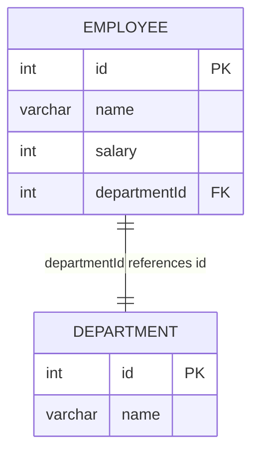

# [leetcode : 185. Department Top Three Salaries](https://leetcode.com/problems/department-top-three-salaries/description/)

## **다이어그램**



## **목표**

> A company's executives are interested in seeing who earns the most money in each of the company's departments. A high earner in a department is an employee who has a salary in the top three unique salaries for that department.
> Write a solution to `find the employees who are high earners in each of the departments.`
> `부서별 상위 3개 고유 급여를 받는 직원 찾기`

## **문제 풀이**

### **MySQL**

[tabs: Solution 1]

```sql
-- SOLUTION 1: DENSE_RANK + JOIN
WITH SALARY_RANK AS (
    SELECT
        *,
        DENSE_RANK() OVER(PARTITION BY DEPARTMENTID ORDER BY SALARY DESC) AS RK
    FROM
        EMPLOYEE
)
SELECT
    D.NAME AS Department,
    SR.NAME AS Employee,
    SR.SALARY AS Salary
FROM
    SALARY_RANK AS SR
LEFT JOIN
    DEPARTMENT AS D
    ON SR.DEPARTMENTID = D.ID
WHERE
    RK <= 3
```

[/tabs]

* SOLUTION 1
  * 이전 문제와 마찬가지로 DENSE RANK + JOIN에 WHERE 조건을 걸어주면 된다.

```sql
WITH SALARY_RANK AS (
    SELECT
        *,
        DENSE_RANK() OVER(PARTITION BY DEPARTMENTID ORDER BY SALARY DESC) AS RK
    FROM
        EMPLOYEE
)

SELECT
    D.NAME AS Department,
    SR.NAME AS Employee,
    SR.SALARY AS Salary
FROM
    SALARY_RANK AS SR
LEFT JOIN
    DEPARTMENT AS D
    ON SR.DEPARTMENTID = D.ID
WHERE
    RK <= 3
```

* SOLUTION 1
  * 이전 문제와 마찬가지로 DENSE RANK + JOIN에 WHERE 조건을 걸어주면 된다.
  
### **Pandas**

[tabs: Solution 1]

```python
# SOLUTION 1: rank + merge
import pandas as pd

def top_three_salaries(employee: pd.DataFrame, department: pd.DataFrame) -> pd.DataFrame:
    employee = employee.copy()
    employee['salary_rank'] = (employee.groupby('departmentId')['salary']
                                .rank(method='dense', ascending=False))
    is_top3 = employee['salary_rank'] <= 3

    joined = pd.merge(employee.loc[is_top3, ['name','salary','departmentId']], department,
                        left_on='departmentId', right_on='id',
                        suffixes=('_emp','_dep'))
    answer = joined.loc[:, ['name_dep','name_emp','salary']]
    answer.columns = ['Department', 'Employee', 'Salary']
    return answer
```

[/tabs]

* SOLUTION 1
  * 가장 큰 값만 찾는게 아니다보니까, agg로 nlargest로 적용하기에는 중복값들로 3개가 채워져서 온전히 구하지 못한다.

## **코멘트**

* 기본 문제
