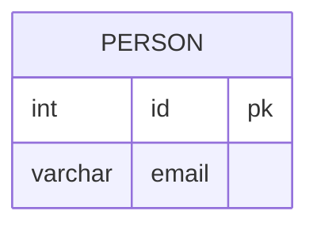

# [leetcode : 196. Delete Duplicate Emails](https://leetcode.com/problems/delete-duplicate-emails/description/)

## **다이어그램**



## **목표**

>Write a solution to `delete all duplicate emails, keeping only one unique email with the smallest id.`
> `중복 이메일을 제거 (테이블 수정하기)`

## **문제 풀이**

### **MySQL**

[tabs: Solution 1, Solution 2, Solution 3]

```sql
-- Solution 1: JOIN
WITH TEMP AS (
    SELECT MIN(id) AS MIN_ID, EMAIL
    FROM PERSON
    GROUP BY EMAIL
)

DELETE P
FROM PERSON P
JOIN TEMP T ON P.EMAIL = T.EMAIL
WHERE ID != MIN_ID
```

```sql
-- Solution 2: NOT IN
WITH TEMP AS (
    SELECT MIN(id) AS MIN_ID, EMAIL
    FROM PERSON
    GROUP BY EMAIL
)

DELETE FROM PERSON 
WHERE ID NOT IN (SELECT MIN_ID FROM TEMP)
```

```sql
-- Solution 3: NOT EXISTS
WITH TEMP AS (
    SELECT MIN(id) AS MIN_ID
    FROM PERSON
    GROUP BY EMAIL
)

DELETE FROM
    PERSON
WHERE
    NOT EXISTS (
        SELECT 1 
        FROM TEMP 
        WHERE TEMP.MIN_ID = PERSON.id
);
```

[/tabs]

* SOLUTION 1
  * `GROUP BY`로 사람마다 `MIN_ID`랑 `EMAIL`을 찾는다.
  * 기존 테이블과 `JOIN`으로 결합하여, `MIN_ID = ID`가 아닌 행들을 `DELETE`로 제거한다.

* SOLUTION 2
  * `MIN_ID`가 아닌 `ID`들을 `NOT IN`을 사용하여 제거한다.
  * `NOT IN`을 사용할 때, `NULL`값이 포함되면 제거되지 않는 문제가 있다.
  * PK가 `NULL`이 될 수 없기 때문에, 문제는 되지 않지만 PK가 아닌 경우에는 알아둬야한다.

* SOLUTION 3
  * `MIN_ID`가 존재하지 않는 행들을 `NOT EXISTS`를 사용하여 제거한다.

### **Pandas**

[tabs: Solution 1]

```python
# SOLUTION 1: sort + drop_duplicates
import pandas as pd

def delete_duplicate_emails(person: pd.DataFrame) -> None:
    person.sort_values('id', inplace=True)
    person.drop_duplicates(subset=['email'], keep='first', inplace=True)
```

[/tabs]

* SOLUTION 1
  * inplace를 안쓰는 방향으로 업데이트를 하고있어서 inplace를 피해야하는데, person이 global로 설정되어있어서 inplace를 써야한다.
  * 리턴값으로 받아서 수정하는게 더 낫지 않나 싶다...

## **코멘트**

* DML 아닌 구문들도 리마인드 자주 하기.
