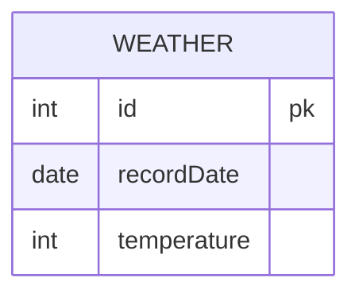

# [leetcode : 197. Rising Temperature](https://leetcode.com/problems/rising-temperature/)

## **다이어그램**



## **목표**

> Write a solution to `find all dates' id with higher temperatures compared to its previous dates (yesterday).`
> `전일 대비 상승한 기온 id 찾기`

## **문제 풀이**

### **MySQL**

[tabs: Solution 1, Solution 2]

```sql
-- SOLUTION 1
SELECT ID
FROM (
    SELECT *,
        DATEDIFF(RECORDDATE, LAG(RECORDDATE) OVER (ORDER BY RECORDDATE)) AS DATEDIFF,
        TEMPERATURE - LAG(TEMPERATURE) OVER (ORDER BY RECORDDATE) AS DAYDIFF
    FROM WEATHER
    ORDER BY RECORDDATE
) AS TEMP
WHERE DATEDIFF = 1 AND DAYDIFF > 0
```

```sql
-- SOLUTION 2
WITH ORDERED AS (
    SELECT
        *,
        LAG(RECORDDATE) OVER (ORDER BY RECORDDATE) AS PREV_D,
        LAG(TEMPERATURE) OVER (ORDER BY RECORDDATE) AS PREV_T
    FROM
        WEATHER
)

SELECT
    `ID`
FROM
    ORDERED
WHERE
    TEMPERATURE - PREV_T > 0 AND
    DATEDIFF(RECORDDATE, PREV_D) = 1
```

[/tabs]

* SOLUTION 1
  * LEAD, LAG처럼 이전, 이후 값을 가져오는 윈도우 함수를 사용해야한다.
  * 서브쿼리 내 ORDER BY 절이 먼저 동작하므로 이전 값을 가져오면 전날인지 아닌지 판단 가능하다.
  * LAG를 사용해서 이전 값을 가져온 테이블을 서브쿼리로 만든다.
  * WHERE 조건으로 조건 맞게 불러와주면 끝.

* SOLUTION 2
  * 비슷한 방법으로 풀이.
  * CTE 쓰는게 순서가 보여서 더 편한듯

### **Pandas**

[tabs: Solution 1, Solution 2, Solution 3]

```python
# SOLUTION 1: shift
import pandas as pd

def rising_temperature(weather: pd.DataFrame) -> pd.DataFrame:
    weather = weather.sort_values('recordDate')
    weather['prev_t'] = weather['temperature'].shift(1)
    weather['diff'] = weather['temperature'] - weather['prev_t']
    weather['prev_date'] = weather['recordDate'].shift(1)

    cond1 = weather['diff'] > 0
    cond2 = (weather['recordDate'] - weather['prev_date']) == pd.Timedelta(days=1)
    return weather[cond1 & cond2][['id']]
```

```python
# SOLUTION 2: iterrows
import pandas as pd
from datetime import timedelta

def rising_temperature(weather: pd.DataFrame) -> pd.DataFrame:
    answer = []

    if not weather.empty:
        weather.sort_values(by='recordDate', inplace=True)
        pre_T, pre_D = weather.iloc[0][['temperature', 'recordDate']]

        for idx, row in weather.iloc[1:].iterrows():
            T, D = row[['temperature', 'recordDate']]
            if pre_T < T and D - pre_D == timedelta(days=1):
                answer.append(row['id'])
            pre_T, pre_D = T, D
            
    return pd.DataFrame({'id': answer})
```

```python
# SOLUTION 3: diff
import pandas as pd

def rising_temperature(weather: pd.DataFrame) -> pd.DataFrame:
    weather.sort_values(by="recordDate", inplace=True)
    is_rising = weather["temperature"].diff() > 0
    is_yesterday = weather["recordDate"].diff().dt.days == 1
    return weather.loc[is_rising & is_yesterday, ["id"]]
```

[/tabs]

* 날짜가 정렬되서 들어오지 않는 케이스가 존재하므로 날짜에 대해서 정렬해주기.

* SOLUTION 1
  * shift 연산을 통해서 날짜랑 시간을 옮긴다.
  * 전날 대비 기온 상승 & 날짜차이가 1일인 id를 반환한다.
  * TABLE 자체가 DATE 객체라서 바로 연산이 가능하지만, 문자열로 들어있는 경우에는 컬럼에 to_datetime 연산을 해줘서 datetime으로 바꿔야한다.
  
* SOLUTION 2
  * iterrow를 사용해서 풀이.
  * 연산량이 많아서 데이터 프레임 크기가 크면 비효율적임.

* SOLUTION 3
  * diff를 쓰면 shift를 사용해서 새로운 컬럼을 할당할 필요가 없다.
  * diff에 정수를 쓰면 그 정수 인덱스 차이만큼 차이난 행에서 연산 진행
  * 기본 인자로 diff(1)이 데이터프레임의 위로부터 아래로 차이를 구한다. (이전 행과의 차이)

## **코멘트**

* LAG, LEAD, shift 등은 잘 안써서 시간 좀 걸린듯

* 오름차순 데이터도 아니고, 빠진 날짜도 있어서 극혐임.
  * 항상 쿼리 치기 전에 전처리를 생각하는 연습을 하기...
  
* SQL에서 날짜연산 함수 정리 한 번 하기.
  * DATE_ADD, ADDDATE 등 형태가 많다. 하나 정해서 연습
