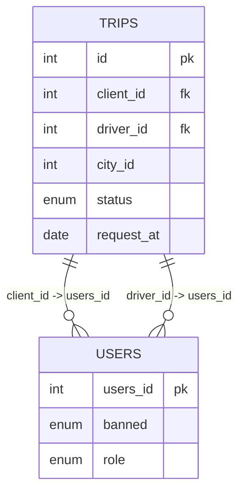

# [leetcode : 262. Trips and Users](https://leetcode.com/problems/trips-and-users/description/)

## **다이어그램**



## **목표**

> Write a solution to `find the cancellation rate of requests with unbanned users (both client and driver must not be banned) each day between "2013-10-01" and "2013-10-03".`
> `밴되지 않은 사용자(client와 driver 모두)의 요청 취소율을 날짜별로 계산하기`

## **문제 풀이**

### **MySQL**

[tabs: Solution 1, Solution 2, Solution 3]

```sql
-- SOLUTION 1
WITH UNBANNED_WINDOW AS (
    SELECT
        *
    FROM
        TRIPS
    WHERE
        REQUEST_AT BETWEEN '2013-10-01' AND '2013-10-03'
        AND CLIENT_ID IN (SELECT USERS_ID FROM USERS WHERE BANNED = 'No')
        AND DRIVER_ID IN (SELECT USERS_ID FROM USERS WHERE BANNED = 'No')
), 

COUNTING AS (
SELECT 
    REQUEST_AT,
    COUNT(REQUEST_AT) AS TOTAL,
    SUM(CASE WHEN STATUS = 'completed' THEN 1 ELSE 0 END) AS COMPLETED
FROM
    UNBANNED_WINDOW
GROUP BY
    REQUEST_AT
)

SELECT
    COUNTING.REQUEST_AT AS Day,
    round(1-(COUNTING.COMPLETED/COUNTING.TOTAL),2) AS "Cancellation Rate"
FROM
    COUNTING
```

```sql
-- SOLUTION 2
SELECT 
    trips.request_at AS Day,
    ROUND(SUM(IF(trips.status = 'completed',0,1))/COUNT(trips.status),2) AS 'Cancellation Rate'
FROM
    trips
WHERE
    trips.client_id NOT IN (SELECT users_id FROM users WHERE users.banned = 'Yes')
    AND trips.driver_id NOT IN (SELECT users_id FROM users WHERE users.banned = 'Yes')
    AND trips.request_at IN ('2013-10-01', '2013-10-02', '2013-10-03')
GROUP BY
    Day;
```

```sql
-- SOLUTION 3
-- 1. banned user : 유효하지 않음.
WITH BANNED AS (
    SELECT USERS_ID
    FROM USERS
    WHERE BANNED = 'Yes'
),

-- 2. 유효하지 않은 trip 가져오고, binary data로 status 변환
TEMP AS (
    SELECT T.CLIENT_ID,
            T.STATUS,
            T.REQUEST_AT,
            IF(STATUS='completed',0,1) AS STATUS_BIN
    FROM TRIPS T
    LEFT JOIN
        USERS U ON U.USERS_ID = T.CLIENT_ID
    WHERE
        CLIENT_ID NOT IN (SELECT USERS_ID FROM BANNED) AND
        DRIVER_ID NOT IN (SELECT USERS_ID FROM BANNED)
),

-- 3. 취소율 구하기
CANCLE_RATE AS (
    SELECT
        REQUEST_AT AS `Day`,
        ROUND(SUM(STATUS_BIN)/COUNT(*),2) AS `Cancellation Rate`
    FROM TEMP
    GROUP BY REQUEST_AT
)

-- 4. 날짜필터 구하기
SELECT `Day`, `Cancellation Rate`
FROM CANCLE_RATE
WHERE `Day` BETWEEN '2013-10-01' AND '2013-10-03'
```

[/tabs]

* SOLUTION 1
  * CTE 써서 필터 조건 하나 걸어주고, 그걸 바탕으로 개수를 센 테이블 만들어주기.
  * 개수를 센 테이블 바탕으로 정답 테이블 만들어주기.

* SOLUTION 2
  * 제 풀이는 아닌데 깔끔하고 속도 빨라서 리트코드 정답에서 가져왔음
  * 기존에 CTE를 WHERE문 조건에 다 넣고, 바로 조건문에서 카운팅이랑 한 번에 해버리기.
  * CASE WHEN 대신 IF를 사용해서 완료면 0, 아니면 1로 값을 채워서 한 번에 계산.

* SOLUTION 3
  * 일단 테이블부터 잘 이해해야한다.
  * Users에는 client, driver 모두 존재한다.
  * trips 테이블에서 둘 중 하나라도 ban이면 그 row는 유효하지 않아서 카운팅하지 않는다.
  * 먼저, Banned User를 CTE에 만들어놓고, 둘 다 밴되지 않은 row들을 where 조건으로 걸어준다.
  * 요일별 cancellation을 구하기 위해, IF문으로 취소됐으면 1, 아니면 0을 사용하고, 다음 CTE에서 sum/count로 비율을 구해준다.
  * 날짜 필터링 구해주기

### **Pandas**

[tabs: Solution 1, Solution 2]

```python
# SOLUTION 1: double join
import pandas as pd

def trips_and_users(trips: pd.DataFrame, users: pd.DataFrame) -> pd.DataFrame:
    window = trips[trips['request_at'].between('2013-10-01','2013-10-03')]
    unbanned = users[users['banned']=='No']

    join = pd.merge(window, unbanned, left_on='client_id', right_on='users_id')
    join = pd.merge(join, unbanned, left_on='driver_id', right_on='users_id')
    grouped = join.groupby(['request_at', 'status']).size().unstack(fill_value=0)
    
    all_statuses = ['completed', 'cancelled_by_driver', 'cancelled_by_client']
    for status in all_statuses:
        if status not in grouped.columns:
            grouped[status] = 0

    grouped['Cancellation Rate'] = ((grouped['cancelled_by_client'] + grouped['cancelled_by_driver']) / grouped.sum(axis=1)).round(2)

    grouped.reset_index(inplace=True)
    grouped.rename(columns={'request_at':'Day'}, inplace=True)
    return grouped[['Day', 'Cancellation Rate']]
```

```python
import pandas as pd

def trips_and_users(trips: pd.DataFrame, users: pd.DataFrame) -> pd.DataFrame:
    unbanned = users[users['banned']=='No']
    is_valid = (trips['client_id'].isin(unbanned['users_id'])
                & trips['driver_id'].isin(unbanned['users_id']))

    is_valid['status_bin'] = np.where(is_valid['status']=='completed',0,1)

    grouped = is_valid.groupby('request_at').agg(
        Cancellation = ('status_bin', lambda group: round(sum(group)/len(group),2))
    ).reset_index()
    time_cond = grouped['request_at'].between('2013-10-01','2013-10-03')
    return grouped[time_cond].rename(columns={'request_at':'Day',
                                        'Cancellation':'Cancellation Rate'})
```

[/tabs]

* SOLUTION 1
  * 조인을 두 번 해줘야 한다. 해시를 통해서 client, driver 모두 체크해도 상관 없긴 한데 join 두 번으로 풀었다.
  * client가 unbanned join table을 만들어서 한 번 필터링 한 후, driver가 unbanned인 경우를 필터링 해준다.
  * 이후 pivot table / groupby unstack을 통해서 표를 만들어야 한다. (이게 다루기 편함)
    * unstack을 통해서 피벗 테이블 형태로 만들어주고, 기존에 비어있던 컬럼은 None 대신 fill_value를 통해서 0으로 채워준다. (연산 오류 방지)
  * pivot table을 만드는 과정에서 기존 테이블에 있었던 columns 속성들도 모두 가져와야 한다.
    * 이렇게 안하면 columns 원소가 존재하지 않는 경우에 키 접근이 안돼서 에러 발생 가능.

* SOLUTION 2
  * Pandas스럽게 푼 풀이.
  * 마찬가지로 unbanned를 설정해주고, cond1 cond2로 각각 valid한 코드를 불러온다.
  * grouped에서 lambda를 적용할 땐, 각 grouped의 DataFrame이 덩어리로 들어온다고 생각하면 편하다.

## **코멘트**

* SQL에서는 SELECT에서 조건문에 IF나 CASE WHEN써서 줄줄이 쓰는게 익숙하지 않다...
* pandas 에서는 조인 두 번 해야된다는 거를 놓쳐서 조금 걸렸음...
* 문제 잘 읽고, 테이블 그리면서 풀면 크게 어려운 문제는 아니다.
