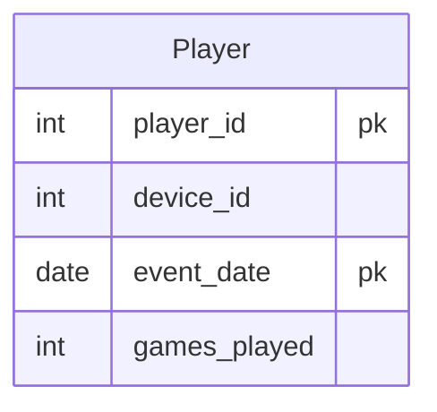

# [leetcode : 511. Game Play Analysis I](https://leetcode.com/problems/game-play-analysis-i/description/)

## **다이어그램**



## **목표**

> Write a solution to `find the first login date for each player.`
> `유저 별 가장 빠른 로그인 시간 찾기`

## **문제 풀이**

### **MySQL**

[tabs: Solution 1]

```sql
-- SOLUTION 1
SELECT PLAYER_ID, MIN(EVENT_DATE) AS FIRST_LOGIN
FROM ACTIVITY
GROUP BY PLAYER_ID
```

[/tabs]

* SOLUTION 1
  * 각 그룹별 최소 날짜 출력하기

### **Pandas**

[tabs: Solution 1, Solution 2, Solution 3]

```python
# SOLUTION 1: groupby + min
import pandas as pd

def game_analysis(activity: pd.DataFrame) -> pd.DataFrame:
    activity['event_date'] = pd.to_datetime(activity['event_date'])
    answer = activity.groupby('player_id')['event_date'].min().reset_index()
    answer.rename(columns={'event_date':'first_login'}, inplace=True)
    return answer
```

```python
# SOLUTION 2: groupby + agg
import pandas as pd

def game_analysis(activity: pd.DataFrame) -> pd.DataFrame:
    answer = activity.groupby('player_id').agg(
        first_login = ('event_date','min')
    ).reset_index()
    return answer
```

```python
# SOLUTION 3: sort_values + drop_duplicates
import pandas as pd

def game_analysis(activity: pd.DataFrame) -> pd.DataFrame:
    activity = activity.sort_values(by='event_date')
    df = activity.drop_duplicates(subset ='player_id', keep='first')
    df = df.drop(columns=['device_id','games_played'])
    return df.rename(columns={'event_date':'first_login'})
```

[/tabs]

* SOLUTION 1, 2
  * groupby로 묶은 후, event date 최소값을 가져와주기.

* SOLUTION 3
  * 정렬 이후 한 번의 순회로도 풀이가 가능하다.
  * 날짜별 정렬을 한 후, 중복 아이디가 나오면 최소 날짜가 아니므로 제거해준다.

## **코멘트**

* 쉬운 문제
