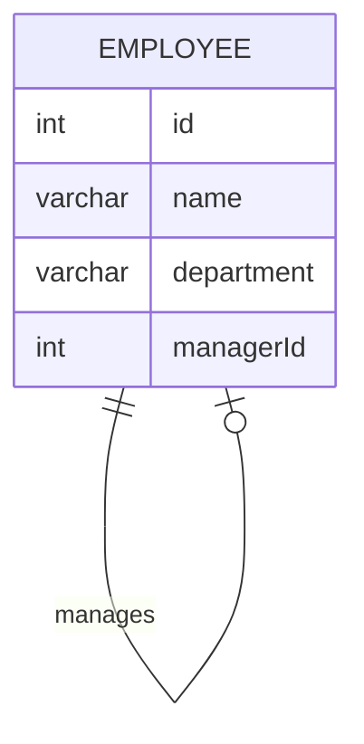

# [leetcode : 570. Managers with at Least 5 Direct Reports](https://leetcode.com/problems/managers-with-at-least-5-direct-reports/description/)

## **다이어그램**



## **목표**

> Write a solution to `find managers with at least five direct reports.`
> `직속 부하가 5명 이상인 매니저 구하기`

## **문제 풀이**

### **MySQL**

[tabs: Solution 1, Solution 2]

```sql
-- SOLUTION 1: 서브쿼리 + IN
SELECT NAME
FROM EMPLOYEE
WHERE ID IN (
    SELECT MANAGERID
    FROM EMPLOYEE
    WHERE MANAGERID IS NOT NULL
    GROUP BY MANAGERID
    HAVING COUNT(MANAGERID) >= 5
    )
```

```sql
-- SOLUTION 2: JOIN + GROUP BY
SELECT b.name
FROM Employee a
JOIN Employee b ON a.managerId = b.id
GROUP BY b.id
HAVING COUNT(*) >= 5
```

[/tabs]

* SOLUTION 1
  * 테이블에서 MANAGER ID가 5개 이상인 ID들만 추려놓는다.
  * ID가 주어진 서브쿼리 내에 있으면 사용 가능

* SOLUTION 2
  * inner join으로 직속 관계를 연결하고, groupby + having으로 5명 이상인 매니저만 필터링
  
### **Pandas**

[tabs: Solution 1, Solution 2]

```python
# SOLUTION 1: groupby + isin
import pandas as pd

def find_managers(employee: pd.DataFrame) -> pd.DataFrame:
    count = employee.groupby('managerId').size().reset_index(name='cnt')
    condition = count[count['cnt'] >= 5]
    return employee.loc[employee['id'].isin(condition['managerId']),['name']]
```

```python
# SOLUTION 2: value_counts + merge
import pandas as pd

def find_managers(employee: pd.DataFrame) -> pd.DataFrame:
    counts = pd.DataFrame(employee['managerId'].value_counts())
    merged = pd.merge(employee, counts, left_on='id',right_on='managerId')
    return merged.loc[merged['count']>=5,['name']]
```

[/tabs]

* SOLUTION 1
  * groupby 이후 조건을 걸어줘서 condition이라는 서브쿼리를 만든다.
  * isin을 사용해서 출력해주기.

* SOLUTION 2
  * 매니저 등장 횟수를 세고, merge를 통해서 등장한 사람 중 5번 이상만 조건 걸어주기

## **코멘트**

* 기본 문제
