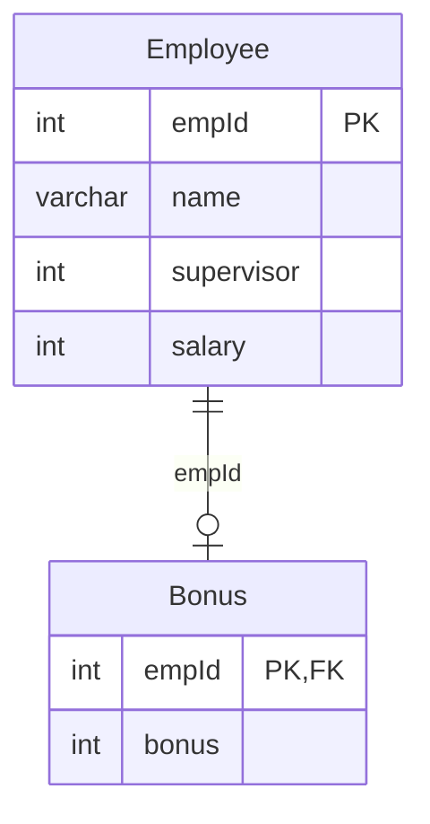

# [leetcode : 577. Employee Bonus](https://leetcode.com/problems/employee-bonus/description/)

## **다이어그램**



## **목표**

> Write a solution to `report the name and bonus amount of each employee with a bonus less than 1000.`
> `보너스가 1000보다 작은 직원의 이름과 보너스 구하기`

## **문제 풀이**

### **MySQL**

[tabs: Solution 1]

```sql
-- SOLUTION 1: LEFT JOIN
SELECT
    E.NAME,
    B.BONUS
FROM
    EMPLOYEE E
LEFT JOIN
    BONUS B
    ON E.EMPID = B.EMPID
WHERE
    B.BONUS IS NULL
    OR B.BONUS < 1000
```

[/tabs]

* SOLUTION 1
  * BONUS가 없는 경우는 테이블에 기록되지 않는다.
  * 이런 사람들도 조회해야 하므로, LEFT JOIN을 해준다.
  * NULL이거나 보너스가 1000보다 작은 사람들을 조회해준다.
  
### **Pandas**

[tabs: Solution 1, Solution 2, Solution3]

```python
# SOLUTION 1: merge + 조건문
import pandas as pd

def employee_bonus(employee: pd.DataFrame, bonus: pd.DataFrame) -> pd.DataFrame:
    merged = pd.merge(employee, bonus, on='empId', how='left')
    cond1 = merged['bonus']<1000
    cond2 = merged['bonus'].isnull()
    return merged.loc[cond1|cond2, ['name','bonus']]
```

```python
# SOLUTION 2: merge + drop
import pandas as pd

def employee_bonus(employee: pd.DataFrame, bonus: pd.DataFrame) -> pd.DataFrame:
    merged = pd.merge(employee, bonus, on='empId', how='left')
    merged = merged.drop(merged[merged['bonus']>=1000].index)
    return merged.loc[:, ['name','bonus']]
```

```python
# SOLUTION 3: 메서드 체이닝
import pandas as pd

def employee_bonus(employee: pd.DataFrame, bonus: pd.DataFrame) -> pd.DataFrame:
    return (
        employee
        .merge(bonus, on="empId", how="left")
        .loc[
            lambda df: df["bonus"].isna() | (df["bonus"] < 1000),
            ["name", "bonus"]
        ]
    )
```

[/tabs]

* SOLUTION 1
  * left join을 통해서 병합한다.
  * 이후에 조건을 걸어서 값 가져오기.
  * 1000 이상 데이터들을 필터링한다.

* SOLUTION 2
  * merge 이후 drop으로 조건 만족시키지 않는 row의 index를 제거한다.

## **코멘트**

* 기본 조인 문제
