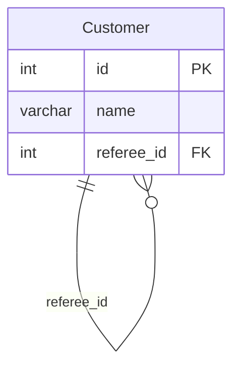

# [leetcode : 584. Find Customer Referee](https://leetcode.com/problems/find-customer-referee/)

## **다이어그램**



## **목표**

> Find the `names of the customer that are not referred by the customer with id = 2.`
> `referee_id가 2가 아닌 고객의 이름 구하기`

## **문제 풀이**

### **MySQL**

[tabs: Solution 1]

```sql
-- SOLUTION 1: WHERE 조건
SELECT
    NAME
FROM
    CUSTOMER
WHERE
    REFEREE_ID IS NULL
    OR REFEREE_ID != 2
```

[/tabs]

* SOLUTION 1
  * IS NULL 또는 != 조건으로 필터링

### **Pandas**

[tabs: Solution 1, Solution 2]

```python
# SOLUTION 1: 조건문
import pandas as pd

def find_customer_referee(customer: pd.DataFrame) -> pd.DataFrame:
    cond1 = ~(customer['referee_id']==2)
    cond2 = customer['referee_id'].isnull()
    return customer.loc[cond1|cond2, ['name']]
```

```python
# SOLUTION 2: drop
import pandas as pd

def find_customer_referee(customer: pd.DataFrame) -> pd.DataFrame:
    return customer.drop(customer[customer['referee_id'] == 2].index).loc[:, ['name']]
```

```python
# SOLUTION 3: 메서드 체이닝
import pandas as pd

def find_customer_referee(customer: pd.DataFrame) -> pd.DataFrame:
    return (
        customer
        .loc[
            lambda row: (row['referee_id'] != 2) | (row['referee_id'].isna()),
            ['name']
        ]
    )
```

[/tabs]

* SOLUTION 1
  * OR 조건으로 두 조건을 묶어주기
  * NULL이거나 2가 아닌 행을 필터링

* SOLUTION 2
  * drop으로 referee_id가 2인 행을 제거

* SOLUTION 3
  * 메서드 체이닝 시, 한 줄로 쓸 때 연산자 우선순위 문제가 생길 수 있다.
  * 조건 같은 경우 항상 ()로 묶어서 진행하기.

## **코멘트**

* 기본 문제
