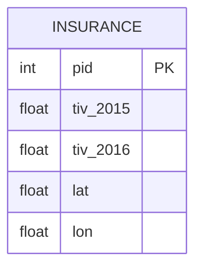

# [leetcode : 585. Investments in 2016](https://leetcode.com/problems/investments-in-2016/)

## **다이어그램**



## **목표**

> Write a solution to report the `sum of all total investment values in 2016 tiv_2016`, for all policyholders who:
> `have the same tiv_2015 value as one or more other policyholders`, and are `not located in the same city` as any other policyholder (i.e., the (lat, lon) attribute pairs must be unique).
> `Round tiv_2016 to two decimal places.`
> `2016 투자 합산 소수점 2자리 반올림 : 다른 policyholders와 같은 tiv2015 & 다른 지역에 살아야함`

## **문제 풀이**

### **MySQL**

[tabs: Solution 1, Solution 2, Solution 3, Solution 4, Solution 5]

```sql
-- SOLUTION 1: CTE + JOIN
WITH A AS (
    SELECT *
    FROM INSURANCE
    WHERE TIV_2015 IN (
        SELECT TIV_2015
        FROM INSURANCE
        GROUP BY TIV_2015
        HAVING COUNT(TIV_2015) > 1)
),
B AS (
    SELECT *
    FROM INSURANCE
    GROUP BY LAT, LON
    HAVING COUNT(*) = 1
)
SELECT ROUND(SUM(A.TIV_2016), 2) AS TIV_2016
FROM A
JOIN B ON A.PID = B.PID
```

```sql
-- SOLUTION 2: CTE + JOIN (더 명확한 네이밍)
WITH TEMP AS (
    SELECT TIV_2015
    FROM INSURANCE
    GROUP BY TIV_2015
    HAVING COUNT(*) > 1
),
SAME_2015 AS (
    SELECT *
    FROM INSURANCE
    WHERE TIV_2015 IN (SELECT * FROM TEMP)
),
NOT_SAME_PLACE AS (
    SELECT *
    FROM INSURANCE
    GROUP BY LAT, LON
    HAVING COUNT(*) = 1
)
SELECT ROUND(SUM(S.TIV_2016),2) AS TIV_2016
FROM SAME_2015 S
JOIN NOT_SAME_PLACE N ON S.PID = N.PID
```

```sql
WITH TEMP1 AS (
    SELECT
        TIV_2015
    FROM
        INSURANCE
    GROUP BY
        TIV_2015
    HAVING
        COUNT(*) > 1
),

TEMP2 AS (
    SELECT
        LAT, LON
    FROM
        INSURANCE
    GROUP BY
        LAT, LON
    HAVING
        COUNT(*) = 1
)

SELECT
    ROUND(SUM(TIV_2016),2) AS 'tiv_2016'
FROM
    INSURANCEqd
WHERE
    TIV_2015 IN (SELECT TIV_2015 FROM TEMP1)
    AND (LAT, LON) IN (SELECT LAT, LON FROM TEMP2)
```

```sql
WITH tiv_dup AS (
    SELECT TIV_2015
    FROM INSURANCE
    GROUP BY TIV_2015
    HAVING COUNT(*) > 1
),
loc_unique AS (
    SELECT LAT, LON
    FROM INSURANCE
    GROUP BY LAT, LON
    HAVING COUNT(*) = 1
)
SELECT
    ROUND(SUM(i.TIV_2016), 2) AS tiv_2016
FROM INSURANCE i
JOIN tiv_dup t
  ON i.TIV_2015 = t.TIV_2015
JOIN loc_unique l
  ON i.LAT = l.LAT
 AND i.LON = l.LON;
```

```sql
SELECT
    ROUND(SUM(TIV_2016), 2) AS tiv_2016
FROM (
    SELECT *,
           COUNT(*) OVER (PARTITION BY TIV_2015) AS tiv_cnt,
           COUNT(*) OVER (PARTITION BY LAT, LON) AS loc_cnt
    FROM INSURANCE
) t
WHERE tiv_cnt > 1
  AND loc_cnt = 1;

```

[/tabs]

* SOLUTION 1
  * 각 조건을 만족시키기 위해서 GROUP BY + HAVING을 사용한다.
  * 두 개의 CTE를 만든 후 JOIN 연산을 진행하기.

* SOLUTION 2
  * SAME_2015를 구하고, 같은 장소에 살지 않는 사람들을 구한 다음에 두 테이블 조인하기.
  * 더 명확한 CTE 네이밍으로 가독성 향상

* Solution 3,4
  * 조금 더 사가블하게 짠 쿼리.
  * Solution 4처럼 IN 대신 JOIN을 쓰자.

* Solution 5
  * Group by <-> Partition by 전환이 바로 생각나면 풀 수 있다.
  * 새로운 컬럼을 추가해주는 것을 서브쿼리에서 사용해서 바로 풀이.

### **Pandas**

[tabs: Solution 1, Solution 2]

```python
# SOLUTION 1: groupby + merge
import pandas as pd

def find_investments(insurance: pd.DataFrame) -> pd.DataFrame:
    A = insurance.groupby('tiv_2015').size()
    A = A[A>1].index
    A = insurance[insurance['tiv_2015'].isin(A)]

    B = insurance.groupby(['lat','lon']).size()
    B = B[B==1].index
    B = insurance.set_index(['lat','lon']).loc[B].reset_index()

    result = A.merge(B, on='pid', how='inner', suffixes=('_l','_r'))
    return pd.DataFrame({'tiv_2016': [round(sum(result['tiv_2016_l']),2)]})
```

```python
import pandas as pd

def find_investments(insurance: pd.DataFrame) -> pd.DataFrame:
    insurance['tiv_count'] = (
        insurance.groupby('tiv_2015')['tiv_2015'].transform('count')
    )
    insurance['loc_count'] = (
        insurance.groupby(['lat', 'lon']).transform('size')
    )

    return (
        insurance
        .loc[
            lambda df: (df['tiv_count'] > 1) & (df['loc_count'] == 1),
            ['tiv_2016']
        ]
        .sum()
        .round(2)
        .to_frame().T
    )
```

[/tabs]

* SOLUTION 1
  * groupby + size로 카운팅을 해주고, 조건에 맞게 필터링 해주기.
  * 두 테이블을 조인 연산 해주기.
  * python에서는 where같이 조건을 걸었을 때, 기존 테이블이 비어있는 경우 예외처리를 해야돼서 merge를 쓰는게 나은듯.
  * 불리언 인덱싱 이외에도, index 자체를 이용해서 isin, loc에 필터링이 가능하다.

* SOLUTION 2
  * transform + 메서드 체이닝으로 풀이
  * 마지막에 round 이후에 reset index를 하면 index 컬럼과 0번 컬럼 (데이터 컬럼)이 생긴다.
  * 바로 메서드 체이닝으로 처리하기 위해 `.to_frame()`을 사용한다.
  * Series -> DataFrame으로 변환하면서 `tiv_2016  | 123.45`와 같은 Row가 생긴다. 
  * 이후 `.T`로 Transpose 시켜주면 된다.

## **코멘트**

* 불리언 인덱싱 이외에도, index 자체를 이용해서 isin, loc에 필터링이 가능하다.
