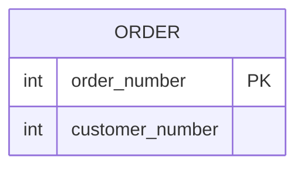

# [leetcode : 586. Customer Placing the Largest Number of Orders](https://leetcode.com/problems/customer-placing-the-largest-number-of-orders/description/)

## **다이어그램**



## **목표**

> Write a solution to `find the customer_number for the customer who has placed the largest number of orders.`
> `주문을 가장 많이 한 고객 번호 구하기`

## **문제 풀이**

### **MySQL**

[tabs: Solution 1, Solution 2, Solution 3]

```sql
-- SOLUTION 1: GROUP BY + HAVING
SELECT
    CUSTOMER_NUMBER
FROM
    ORDERS
GROUP BY
    CUSTOMER_NUMBER
HAVING
    COUNT(ORDER_NUMBER) = (
        SELECT
            MAX(CNT)
        FROM
            (
            SELECT
                COUNT(ORDER_NUMBER) AS CNT
            FROM
                ORDERS
            GROUP BY CUSTOMER_NUMBER)
        AS TEMP
)
```

```sql
-- SOLUTION 2: GROUP BY + ORDER BY + LIMIT
SELECT
    CUSTOMER_NUMBER
FROM
    ORDERS
GROUP BY
    CUSTOMER_NUMBER
ORDER BY
    COUNT(*) DESC
LIMIT 1
```

```sql
SELECT customer_number
FROM (
    SELECT
        customer_number,
        COUNT(*) AS cnt,
        RANK() OVER (ORDER BY COUNT(*) DESC) AS rnk
    FROM orders
    GROUP BY customer_number
) t
WHERE rnk = 1;
```

[/tabs]

* SOLUTION 1
  * GROUP BY에서 ORDER 수를 계산한다.
  * 계산한 ORDER 수의 최대값을 HAVING 조건에 걸어서 뽑아주기.

* SOLUTION 2
  * 정렬 후, LIMIT로 하나만 출력

* SOLUTION 3
  * 서브쿼리에서 바로 카운팅 + 등수처리 이후 1등 뽑기
  * 동점자 타이를 처리할 수 있는 장점이 있다.

### **Pandas**

[tabs: Solution 1, Solution 2, Solution 3, Solution 4]

```python
# SOLUTION 1: groupby + size
import pandas as pd

def largest_orders(orders: pd.DataFrame) -> pd.DataFrame:
    if orders.empty:
        return pd.DataFrame({'customer_number':[]})
    temp = orders.groupby('customer_number').size().reset_index(name='count')
    max_count = temp[temp['count'] == max(temp['count'])]
    answer = max_count.merge(orders, on='customer_number')
    return answer[['customer_number']].head(1)
```

```python
# SOLUTION 2: mode
import pandas as pd

def largest_orders(orders: pd.DataFrame) -> pd.DataFrame:
    return orders['customer_number'].mode().to_frame()
```

```python
# SOLUTION 3: value_counts
import pandas as pd

def largest_orders(orders: pd.DataFrame) -> pd.DataFrame:
    orders_counts = pd.DataFrame(orders['customer_number'].value_counts().reset_index())
    cond = orders_counts['count'] == (orders_counts['count'].max())
    return orders_counts.loc[cond, ['customer_number']]
```

```python
import pandas as pd

def largest_orders(orders: pd.DataFrame) -> pd.DataFrame:
    return (
        orders
        .groupby('customer_number', as_index=False)
        .size()
        .rename(columns={'size': 'cnt'})
        .assign(
            rnk=lambda df: df['cnt']
                .rank(method='min', ascending=False)
        )
        .loc[lambda df: df['rnk'] == 1, ['customer_number']]
    )
```

[/tabs]

* SOLUTION 1
  * groupby + size로 카운팅 후 최대값 찾기

* SOLUTION 2
  * mode()를 사용해서 가장 빈도가 높은 값 찾기

* SOLUTION 3
  * value_counts()로 카운팅 후 최대값 찾기

* SOLUTION 4
  * 메서드 체이닝 풀이.

## **코멘트**

* 기본 문제
