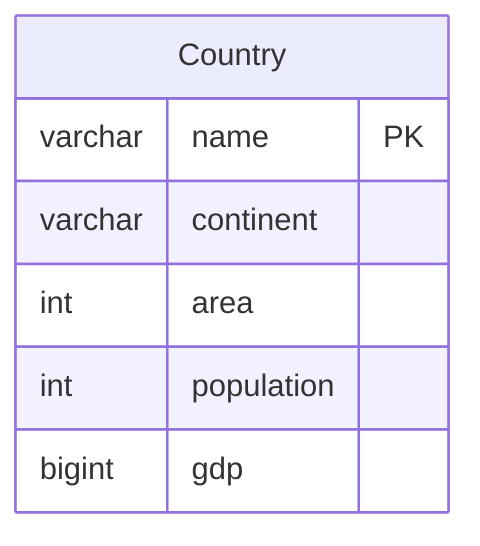

# [leetcode : 595. Big Countries](https://leetcode.com/problems/big-countries/description/)

## **다이어그램**



## **목표**

> Write a solution to `report the name, population, and area of the big countries.`
> `면적이 3,000,000 이상이거나 인구가 25,000,000 이상인 나라 구하기`

## **문제 풀이**

### **MySQL**

[tabs: Solution 1]

```sql
-- SOLUTION 1: WHERE 조건
SELECT NAME, POPULATION, AREA
FROM WORLD
WHERE AREA >= 3000000 OR POPULATION >= 25000000
```

[/tabs]

* SOLUTION 1
  * OR 조건으로 필터링

### **Pandas**

[tabs: Solution 1, Solution 2, Solution 3]

```python
# SOLUTION 1: 직접 조건
import pandas as pd

def big_countries(world: pd.DataFrame) -> pd.DataFrame:
    return world.loc[(world['area'] >= 3000000) | (world['population'] >= 25000000), ['name','population','area']]
```

```python
# SOLUTION 2: 조건 변수 분리
import pandas as pd

def big_countries(world: pd.DataFrame) -> pd.DataFrame:
    cond1 = world['area'] >= 3000000
    cond2 = world['population'] >= 25000000
    return world.loc[cond1|cond2, ['name','population','area']]
```

```python
# SOLUTION 3: 메서드 체이닝
import pandas as pd

def big_countries(world: pd.DataFrame) -> pd.DataFrame:
    return (
        world
        .loc[
            lambda row: (row['area'] >= 3000000) | (row['population'] >= 25000000),
            ['name','population','area']
        ]
    )
```

[/tabs]

* SOLUTION 1
  * 직접 조건을 작성하여 필터링

* SOLUTION 2
  * 조건을 변수로 분리하여 가독성 향상
  * OR 조건이라 row 단위로 검사할 때 앞 조건만 맞으면 true 처리하고 넘어가는데, cond1 cond2를 할당하면 full scan 두 번에 리턴에서 한 번 더 진행한다.
  * 가독성과 성능의 타협점을 고려해서 사용해야 함

* SOLUTION 3
  * 메서드 체이닝

## **코멘트**

* 기본 문제
