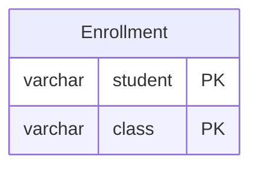

# [leetcode : 596. Classes More Than 5 Students](https://leetcode.com/problems/classes-more-than-5-students/description/)

## **다이어그램**



## **목표**

> Write a solution to `find all the classes that have at least five students.`
> `학생이 5명 이상인 수업 구하기`

## **문제 풀이**

### **MySQL**

[tabs: Solution 1]

```sql
-- SOLUTION 1: GROUP BY + HAVING
SELECT
    CLASS
FROM
    COURSES
GROUP BY
    CLASS
HAVING
    COUNT(*) >= 5
```

[/tabs]

* SOLUTION 1
  * 단순 GROUP BY + COUNT

### **Pandas**

[tabs: Solution 1, Solution 2, Solution 3, Solution 4]

```python
# SOLUTION 1: groupby + size
import pandas as pd

def find_classes(courses: pd.DataFrame) -> pd.DataFrame:
    count = courses.groupby('class').size().reset_index(name='count')
    return count.loc[count['count'] >= 5, ['class']]
```

```python
# SOLUTION 2: groupby + count
import pandas as pd

def find_classes(courses: pd.DataFrame) -> pd.DataFrame:
    count = courses.groupby('class')['student'].count().reset_index()
    count = count.rename(columns={'student': 'count'})
    return count.loc[count['count'] >= 5, ['class']]
```

```python
# SOLUTION 3: groupby + agg
import pandas as pd

def find_classes(courses: pd.DataFrame) -> pd.DataFrame:
    count = courses.groupby('class').agg(count=('student', 'count')).reset_index()
    return count.loc[count['count'] >= 5, ['class']]
```

```python
# SOLUTION 4: 메서드 체이닝
import pandas as pd

def find_classes(courses: pd.DataFrame) -> pd.DataFrame:
    return (
        courses
        .groupby('class', as_index=False)
        .agg(
            cnt = ('student','size')
        )
        .loc[
            lambda row: row['cnt'] >= 5,
            ['class']
        ]
    )
```

[/tabs]

* SOLUTION 1
  * groupby size로 구해주고, 카운팅 컬럼명 reset_index로 지정해주기.

* SOLUTION 2
  * groupby count는 연산 후 컬럼명이 유지된다. class로 묶고, student 수가 나온다.

* SOLUTION 3
  * groupby + agg를 쓰는 것을 선호한다.
  * agg 전달 시 'new_col' = ('col1','agg_func') 형식으로 설정하는 것을 제일 선호함.
  * groupby size / count의 차이점은 컬럼명 없음 / 컬럼명 유지한다는 것.

* SOLUTION 4
  * 메서드 체이닝

## **코멘트**

* 쉬운 문제
