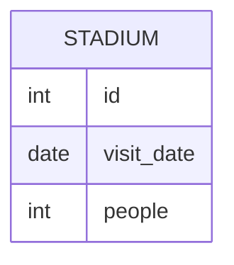

# [leetcode : 601. Human Traffic of Stadium](https://leetcode.com/problems/human-traffic-of-stadium/description/)

## **다이어그램**


## **목표**

> Write a solution to `display the records with three or more rows with consecutive id's, and the number of people is greater than or equal to 100 for each.`
> Return the result table ordered by visit_date in ascending order.
> `연속된 3개 이상의 행에서 각 행의 사람 수가 100 이상인 row 정보 추출하기`

## **문제 풀이**

### **MySQL**

[tabs: Solution 1, Solution 2, Solution3]

```sql
-- SOLUTION 1: LEAD + LAG
WITH CONSECUTIVE AS (
    SELECT *
    FROM (
        SELECT *,
            LAG(PEOPLE) OVER (ORDER BY VISIT_DATE) AS PREV_PEOPLE,
            LEAD(PEOPLE) OVER (ORDER BY VISIT_DATE) AS NEXT_PEOPLE
        FROM STADIUM
        ) AS TEMP
    WHERE PEOPLE >= 100 AND PREV_PEOPLE >= 100 AND NEXT_PEOPLE >= 100
)
SELECT *
FROM STADIUM
WHERE ID IN (
    SELECT ID FROM CONSECUTIVE
    UNION
    SELECT ID+1 FROM CONSECUTIVE
    UNION
    SELECT ID-1 FROM CONSECUTIVE
)
ORDER BY VISIT_DATE
```

```sql
-- SOLUTION 2: 윈도우 함수 + RANGE
WITH q1 AS (
    SELECT *, 
        COUNT(*) OVER (ORDER BY id RANGE BETWEEN CURRENT ROW AND 2 FOLLOWING) AS following_cnt,
        COUNT(*) OVER (ORDER BY id RANGE BETWEEN 2 PRECEDING AND CURRENT ROW) AS preceding_cnt,
        COUNT(*) OVER (ORDER BY id RANGE BETWEEN 1 PRECEDING AND 1 FOLLOWING) AS current_cnt
    FROM stadium
    WHERE people > 99
)
SELECT id, visit_date, people
FROM q1
WHERE following_cnt = 3 OR preceding_cnt = 3 OR current_cnt = 3
ORDER BY visit_date
```

```sql
WITH cte AS (
    SELECT *,
           id - ROW_NUMBER() OVER (ORDER BY id) AS grp
    FROM Stadium
    WHERE people >= 100
)
SELECT id, visit_date, people
FROM cte
WHERE grp IN (
    SELECT grp
    FROM cte
    GROUP BY grp
    HAVING COUNT(*) >= 3
)
ORDER BY visit_date;
```

[/tabs]

* SOLUTION 1
  * LEAD, LAG로 이전행, 다음행 모두 조건을 만족하는 CTE를 만든다.
  * 이 테이블에 있는 ID에 +- 1을 해준 데이터들도 정답이므로 UNION을 통해서 가져오기.

* SOLUTION 2
  * 자신 포함 위 아래 행이 조건을 만족시키면 카운팅해준다.
  * 3개 모두 만족시키는 행만 불러오는 풀이.

* Solution 3
  * 연속된 그룹 찾기에 자주 사용되는 테크닉.
  * 풀이 찾아보다가 봤는데 기가 막히다.
  * 정렬된 조건 기준이 있으니, 같은 그룹에서 id랑 ROW_NUMBER()를 연산했을 때 값이 일정하게 유지된다.
  * 그룹의 크기가 3 이상인 경우 출력하기.

    | id (날짜/ID) | ROW_NUMBER (순서) | **id - RN (그룹 ID)** | 설명 |
    | :--- | :--- | :--- | :--- |
    | **5** | 1 | **4** | **[그룹 A]** 시작 |
    | **6** | 2 | **4** | 연속됨 (차이 4 유지) |
    | **7** | 3 | **4** | 연속됨 (차이 4 유지) |
    | **10** | 4 | **6** | **[그룹 B]** 시작 (ID가 튀어서 차이 변경) |
    | **11** | 5 | **6** | 연속됨 (차이 6 유지) |

### **Pandas**

[tabs: Solution 1, Solution 2, Solution 3, Solution 4]

```python
# SOLUTION 1: shift + iterrows
import pandas as pd

def human_traffic(stadium: pd.DataFrame) -> pd.DataFrame:
    stadium['prev_people'] = stadium['people'].shift(1)
    stadium['next_people'] = stadium['people'].shift(-1)

    answer = set()
    for idx, row in stadium.iterrows():
        if pd.notnull(row['people']) and pd.notnull(row['prev_people']) and pd.notnull(row['next_people']) and \
           row['people'] >= 100 and row['prev_people'] >= 100 and row['next_people'] >= 100:
            answer.update((row['id'],row['id']-1,row['id']+1))

    return stadium.loc[stadium['id'].isin(answer), ['id','visit_date','people']]
```

```python
# SOLUTION 2: shift + isin
import pandas as pd

def human_traffic(stadium: pd.DataFrame) -> pd.DataFrame:
    stadium['prev_people'] = stadium['people'].shift(1)
    stadium['next_people'] = stadium['people'].shift(-1)

    cond1 = stadium['prev_people']>=100
    cond2 = stadium['people']>=100
    cond3 = stadium['next_people']>=100
    ids = set(stadium.loc[cond1&cond2&cond3, 'id'])
    
    return stadium.loc[stadium['id'].isin(ids | {i-1 for i in ids} | {i+1 for i in ids}), ['id','visit_date','people']]
```

```python
# SOLUTION 3: rolling + min
import pandas as pd

def human_traffic(stadium: pd.DataFrame) -> pd.DataFrame:
    cond = stadium['people'].rolling(window=3).min() >= 100
    return stadium.loc[cond|cond.shift(-1)|cond.shift(-2), ['id','visit_date','people']]
```

```python
import pandas as pd

def human_traffic(stadium: pd.DataFrame) -> pd.DataFrame:
    cond = (stadium['people']
            .rolling(window=3)
            .min() >= 100)
    return (
        stadium
        .loc[
            cond | cond.shift(-1) | cond.shift(-2),
            stadium.columns
        ]
    )
```

[/tabs]

* SOLUTION 1
  * shift로 이전/다음 행 값을 가져온 후 iterrows로 순회
  * row base가 느리긴 한 듯

* SOLUTION 2
  * 3개 연속으로 100 넘는 행의 id를 먼저 구한다.
  * 조건문에서 ids값에서 +- 1 값들을 더한 집합 안에 들어있는 행들을 모두 불러오기.

* SOLUTION 3
  * rolling window로 구간 내 최소값으로 조건을 걸어서 푼다.
  * boolean indexing된 결과 자체도 shift로 풀이가 가능하다.

## **코멘트**

* 윈도우 함수도 슬슬 익숙해져서 금방 풀린다.