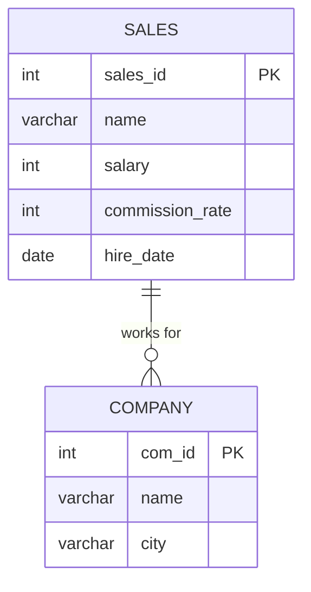

# [leetcode : 607. Sales Person](https://leetcode.com/problems/sales-person/description/)

## **다이어그램**


## **목표**

> Write a solution to `find the names of all the salespersons who did not have any orders related to the company with the name "RED".`
> `RED 회사와 관련된 주문이 없는 영업사원 이름 구하기`

## **문제 풀이**

### **MySQL**

[tabs: Solution 1, Solution 2]

```sql
-- SOLUTION 1: NOT IN
SELECT NAME
FROM SALESPERSON
WHERE SALES_ID NOT IN (
    SELECT SALES_ID
    FROM ORDERS
    WHERE COM_ID = (SELECT COM_ID FROM COMPANY WHERE NAME = 'RED'))
```


```sql
SELECT
    S.NAME
FROM
    SALESPERSON S
WHERE NOT EXISTS (
    SELECT 1
    FROM ORDERS O
    JOIN (
        SELECT COM_ID 
        FROM COMPANY 
        WHERE NAME = 'RED'
    ) C ON O.COM_ID = C.COM_ID
    WHERE O.SALES_ID = S.SALES_ID
);
```

[/tabs]

* SOLUTION 1
  * RED 회사 넘버를 찾은 다음 ORDER TABLE에서 COM_ID가 RED와 관련있는 것들을 모두 뽑는다.
  * SALES_ID가 이 서브쿼리에 없으면 된다. NOT IN 사용해서 작성하기.

* Solution 2
  * 사가블하게 풀이?
  * 조인 하기 전에 먼저 필터링을 한 후에 조인을 진행한다.
  * NOT IN 대신 Not Exists를 사용해서 성능 개선하기

### **Pandas**

[tabs: Solution 1]

```python
# SOLUTION 1: isin
import pandas as pd

def sales_person(sales_person: pd.DataFrame, company: pd.DataFrame, orders: pd.DataFrame) -> pd.DataFrame:
    red = company[company['name'] == 'RED'][['com_id']]
    red_sales = orders[orders['com_id'].isin(red['com_id'])][['sales_id']]
    return sales_person.loc[~sales_person['sales_id'].isin(red_sales['sales_id']), ['name']]
```

[/tabs]

* SOLUTION 1
  * isin을 사용해서 데이터프레임에 조건 걸어주기.
  * SQL에서 두 번의 서브쿼리를 사용하듯이 두 개의 임시 데이터프레임을 만들고 isin으로 조건을 걸어준다.

## **코멘트**

* 쉬운 문제
