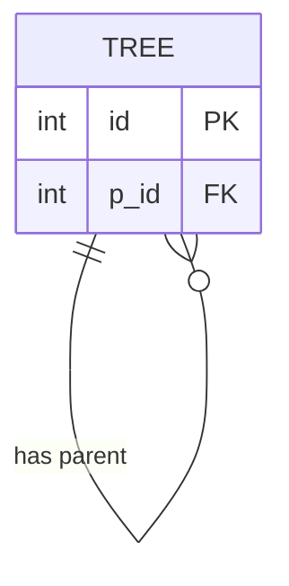

# [leetcode : 608. Tree Node](https://leetcode.com/problems/tree-node/description/)

## **다이어그램**


## **목표**

> Write a solution to `report the type of each node in the tree.`
> `각 노드의 타입 찾기 (Root, Leaf, Inner)`

## **문제 풀이**

### **MySQL**

[tabs: Solution 1, Solution 2]

```sql
-- SOLUTION 1: CTE + CASE WHEN
WITH ROOT AS (
    SELECT ID
    FROM TREE
    WHERE P_ID IS NULL
),
LEAF AS (
    SELECT ID
    FROM TREE
    WHERE ID NOT IN (SELECT P_ID FROM TREE WHERE P_ID IS NOT NULL)
)
SELECT ID,
    CASE 
        WHEN ID IN (SELECT ID FROM ROOT) THEN 'Root'
        WHEN ID IN (SELECT ID FROM LEAF) THEN 'Leaf'
        ELSE 'Inner'
    END AS TYPE
FROM TREE
```

```sql
-- SOLUTION 2: CASE WHEN
SELECT T.ID, 
    CASE 
        WHEN T.P_ID IS NULL THEN 'Root'
        WHEN T.ID NOT IN (SELECT P_ID FROM TREE WHERE P_ID IS NOT NULL) THEN 'Leaf'
        ELSE 'Inner'
    END AS TYPE
FROM TREE T
```

[/tabs]

* SOLUTION 1
  * 루트 노드는 부모 = NULL
  * 리프 노드는 NULL이 아닌 애들 중에서, ID가 부모에 등장하지 않은 애들
  * NULL이 포함된 행에 NOT IN을 쓰면 제대로 동작하지 않는다.
  * CASE WHEN문을 사용해서 컬럼 작성해주기.

* SOLUTION 2
  * CTE 없이 직접 CASE WHEN으로 처리

### **Pandas**

[tabs: Solution 1, Solution 2]

```python
# SOLUTION 1: 조건문 + join
import pandas as pd

def tree_node(tree: pd.DataFrame) -> pd.DataFrame:
    root = tree[tree['p_id'].isnull()].copy()
    root['type'] = 'Root'

    leaf = tree[(~tree['id'].isin(tree['p_id'])) & (~tree['id'].isin(root['id']))].copy()
    leaf['type'] = 'Leaf'

    temp = pd.concat([root,leaf])
    answer = pd.merge(tree, temp, on='id', how='left')
    answer['type'].fillna('Inner', inplace=True)
    return answer[['id','type']]
```

```python
# SOLUTION 2: custom func
import pandas as pd

def tree_node(tree: pd.DataFrame) -> pd.DataFrame:
    def find_type(row):
        if pd.isnull(row['p_id']):
            return 'Root'
        elif row['id'] not in tree['p_id'].values:
            return 'Leaf'
        else:
            return 'Inner'

    tree = tree.copy()
    tree['type'] = tree.apply(find_type, axis=1)
    return tree[['id','type']]
```

[/tabs]

* SOLUTION 1
  * root, leaf를 각각 찾고 concat 시키기.
  * left join을 해주면 null이 나오는데 이 자리는 inner로 채우는 자리.

* SOLUTION 2
  * 함수를 하나 만들어서 row 단위로 판단한다.
  * 부모가 없으면 root, 부모가 p_id의 values에 없으면 leaf.
  * isin대신 values를 쓴 이유는 null값을 제외하려면 values로 해야한다.
  * 둘 다 아니면 inner.

## **코멘트**

* 같은 방식으로 짜도 SQL이랑 pandas랑 동작속도 차이가 좀 있다.
  * row base, columns base 차이라서 그런듯
