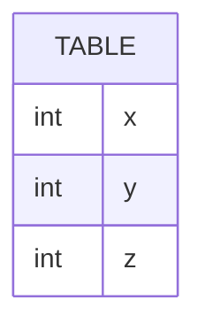

# [leetcode : 610. Triangle Judgement](https://leetcode.com/problems/triangle-judgement/description/)

## **다이어그램**


## **목표**

> Write a solution to `report for every three line segments whether they can form a triangle.`
> `삼각형 조건 만족하는지 확인하기 (두 변의 합이 나머지 한 변보다 커야 함)`

## **문제 풀이**

### **MySQL**

[tabs: Solution 1]

```sql
-- SOLUTION 1: IF
SELECT *, IF(X+Y<=Z OR Y+Z<=X OR Z+X<=Y, "No", "Yes") AS TRIANGLE
FROM TRIANGLE
```

[/tabs]

* SOLUTION 1
  * 간단한 BINARY 조건문이니 IF 사용하기
  * 조건문에서 개별 조건들을 최대한 조금만 통과하게 AND 대신 OR를 사용하기.

### **Pandas**

[tabs: Solution 1, Solution 2]

```python
# SOLUTION 1: apply
import pandas as pd

def triangle_judgement(triangle: pd.DataFrame) -> pd.DataFrame:
    def check(row):
        x, y, z = row['x'], row['y'], row['z']
        if x+y>z and y+z>x and z+x>y:
            return 'Yes'
        return 'No'
 
    triangle = triangle.copy()
    triangle['triangle'] = triangle.apply(check, axis=1)
    return triangle
```

```python
# SOLUTION 2: np.where
import pandas as pd
import numpy as np

def triangle_judgement(triangle: pd.DataFrame) -> pd.DataFrame:
    triangle = triangle.copy()
    triangle['triangle'] = np.where((triangle['x'] + triangle['y'] <= triangle['z']) |
                                    (triangle['y'] + triangle['z'] <= triangle['x']) |
                                    (triangle['z'] + triangle['x'] <= triangle['y']),
                                    'No', 'Yes')
    return triangle
```

[/tabs]

* SOLUTION 1
  * apply로 접근하기.
  * apply 함수 적용 시, 각 row를 입력으로 받는다.

* SOLUTION 2
  * np.where로 접근하기. (SQL의 IF와 같은 역할을 한다)
  * IF문을 중첩해서 쓰기보다는 case when을 쓰는 것 처럼 간단한 경우에 사용하기.
  * AND, OR 접근 시 최대한 많은 조건을 통과하지 않게 조건을 반대로 걸고 AND/OR도 반대로 쓰기

## **코멘트**

* 쉬운 문제
