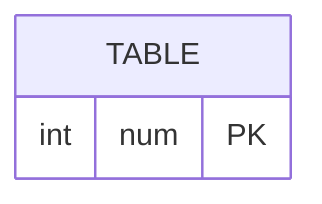

# [leetcode : 619. Biggest Single Number](https://leetcode.com/problems/biggest-single-number/description/)

## **다이어그램**


## **목표**

> Write a solution to `report the largest single number. If there is no single number, report null.`
> `한 번만 등장하는 숫자 중 가장 큰 수 구하기`

## **문제 풀이**

### **MySQL**

[tabs: Solution 1, Solution 2, Solution 3]

```sql
-- SOLUTION 1: 서브쿼리 + MAX
SELECT
    MAX(NUM) AS NUM
FROM (
    SELECT NUM
    FROM MYNUMBERS
    GROUP BY NUM
    HAVING COUNT(*) = 1
) AS TEMP;
```

```sql
-- SOLUTION 2: 서브쿼리 + ORDER BY + COALESCE
SELECT 
    COALESCE((
        SELECT NUM
        FROM (
            SELECT NUM, COUNT(*) AS CNT
            FROM MYNUMBERS
            GROUP BY NUM
            HAVING CNT = 1
        ) SUB
        ORDER BY NUM DESC
        LIMIT 1
    ), NULL) AS NUM
```

```sql
SELECT (
    SELECT NUM
    FROM MYNUMBERS
    GROUP BY NUM
    HAVING COUNT(*) = 1
    ORDER BY NUM DESC
    LIMIT 1
) AS NUM;
```

[/tabs]

* SOLUTION 1
  * 서브쿼리 사용해주기.
  * 집계함수에 아무것도 없으면 null을 반환한다.

* SOLUTION 2
  * NULL처리를 위해 COALESCE 사용

* SOLUTION 3
  * 스칼라 서브쿼리를 마찬가지로 사용해서 NULL을 반환할 수 있다.

### **Pandas**

[tabs: Solution 1, Solution 2]

```python
# SOLUTION 1: value_counts
import pandas as pd

def biggest_single_number(my_numbers: pd.DataFrame) -> pd.DataFrame:
    cnt = my_numbers['num'].value_counts()
    cnt_unique = cnt[cnt == 1]
    if cnt_unique.empty:
        return pd.DataFrame({'num': [None]})
    return pd.DataFrame({'num': [cnt_unique.index.max()]})
```

```python
# SOLUTION 2: drop_duplicates
import pandas as pd

def biggest_single_number(my_numbers: pd.DataFrame) -> pd.DataFrame:
    my_numbers = my_numbers.drop_duplicates('num', keep=False)
    if my_numbers.empty:
        return pd.DataFrame({'num': [None]})
    return pd.DataFrame({'num': [my_numbers['num'].max()]})
```

[/tabs]

* SOLUTION 1
  * 각 숫자가 몇 번 나왔는지 체크한 후, 1개인 것만 가져오기.
  * 데이터프레임이 비어있는 경우를 생각해서 추가로 지정
  * index랑 집계함수를 같이쓰는 메서드 체인이 자주 등장한다. 사용법 익히기!

* SOLUTION 2
  * drop_duplicates를 사용해서 중복 행을 모두 삭제한다. (keep=False는 중복행을 모두 삭제)
  * 이 중 최대값을 가져오기.

## **코멘트**

* 카운팅 횟수가 의미 없어지는 문제에서 drop_duplicates가 상당히 좋아보임
* 스칼라 서브쿼리, 집계함수의 결과는 결과가 없는 경우 NULL을 반환할 수 있는 것을 항상 생각하기.