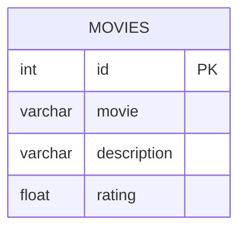

# [leetcode : 620. Not Boring Movies](https://leetcode.com/problems/not-boring-movies/description/)

## **다이어그램**


## **목표**

> Write a solution to `report the movies with an odd-numbered ID and a description that is not "boring".`
> Return the result ordered by rating in descending order.
> `id가 홀수이고 지루하지 않은 영화 구하기`

## **문제 풀이**

### **MySQL**

[tabs: Solution 1]

```sql
-- SOLUTION 1: WHERE 조건
SELECT *
FROM CINEMA
WHERE ID%2 = 1 AND DESCRIPTION != 'boring'
ORDER BY RATING DESC
```

[/tabs]

* SOLUTION 1
  * 기본 문제

### **Pandas**

[tabs: Solution 1]

```python
# SOLUTION 1: 조건 + sort_values
import pandas as pd

def not_boring_movies(cinema: pd.DataFrame) -> pd.DataFrame:
    cond1 = (cinema['id'] % 2) == 1
    cond2 = cinema['description'] != 'boring'
    return cinema.loc[cond1 & cond2].sort_values('rating', ascending=False)
```

[/tabs]

* SOLUTION 1
  * 조건 필터링 후 정렬

## **코멘트**

* 기본 문제
