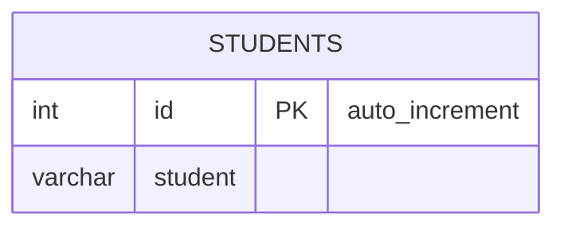

# [leetcode : 626. Exchange Seats](https://leetcode.com/problems/exchange-seats/description/)

## **다이어그램**


## **목표**

> Write a solution to `swap the seat id of every two consecutive students. If the number of students is odd, the id of the last student is not swapped.`
> `홀짝 인덱스 스왑하기 (학생 수가 홀수면 마지막 학생은 스왑하지 않음)`

## **문제 풀이**

### **MySQL**

[tabs: Solution 1, Solution 2]

```sql
-- SOLUTION 1: CTE + LEAD/LAG
WITH SWAP_SEAT AS (
    SELECT *,
        CASE 
            WHEN MOD(ID,2) THEN LEAD(ID) OVER (ORDER BY ID)
            ELSE LAG(ID) OVER (ORDER BY ID)
        END AS SWAP
    FROM SEAT
)
SELECT COALESCE(SWAP, (SELECT COUNT(*) FROM SWAP_SEAT)) AS ID, STUDENT
FROM SWAP_SEAT
ORDER BY ID;
```

```sql
-- SOLUTION 2: CASE WHEN
SELECT 
    CASE 
        WHEN ID = (SELECT MAX(ID) FROM SEAT) AND ID%2=1 THEN ID 
        WHEN ID%2=1 THEN ID+1
        ELSE ID-1
    END AS ID,
    STUDENT
FROM SEAT
ORDER BY ID
```

```sql
SELECT 
    ROW_NUMBER() OVER(ORDER BY GRP, Q) AS ID,
    STUDENT
FROM (
    SELECT 
        STUDENT,
        FLOOR((ID - 1) / 2) AS GRP,
        ID % 2 AS Q
    FROM SEAT
) AS TEMP
```

[/tabs]

* SOLUTION 1
  * 홀수 짝수에 맞춰서 lead lag를 case when 조건문으로 가져온다.
  * 마지막 홀수id는 항상 뒤에거를 가져와야 하는데 가져올 수 없어서 NULL값이다.
  * 이 부분을 COALESCE를 사용해주면 된다.

* SOLUTION 2
  * 마지막 홀수 ROW면 그대로
  * 아니면 SWAP

* SOLUTION 3
  * 내부 서브쿼리에서 2명씩 GROUP으로 태깅을 하고 내부 순서 지정을 위한 나머지 Q를 정의한다.
  * 메인 쿼리에서 ROW NUMBER를 활용해서 AUTO INC 지정해주면 완료.

### **Pandas**

[tabs: Solution 1, Solution 2]

```python
# SOLUTION 1: apply
import pandas as pd

def exchange_seats(seat: pd.DataFrame) -> pd.DataFrame:
    h = len(seat)
    seat = seat.copy()
    seat['swap_id'] = seat.apply(lambda x: min(x['id']+1,h) if x['id']%2 else min(x['id']-1,h), axis=1)
    seat.sort_values('swap_id', inplace=True)
    seat.drop(columns=['id'], inplace=True)
    seat.rename(columns={'swap_id':'id'}, inplace=True)
    return seat[['id','student']]
```

```python
# SOLUTION 2: odd/even 분리
import pandas as pd

def exchange_seats(seat: pd.DataFrame) -> pd.DataFrame:
    odd = seat[seat['id']%2==1].copy()
    odd['id'] = odd['id'] + 1
    even = seat[seat['id']%2==0].copy()
    even['id'] = even['id'] - 1
    answer = pd.concat([odd,even]).sort_values('id')
    answer['id'] = range(1,answer.shape[0]+1)
    return answer[['id','student']]
```

[/tabs]

* SOLUTION 1
  * apply를 통해서 한 번에 해결해주기.
  * 마지막 id를 처리해주기 위해서 min값을 사용.
  * 마지막 id+1은 튜플수보다 많아서 최대치를 튜플 수를 h로 정해버린다.

* SOLUTION 2
  * odd, even 따로 구한 후 인덱스 연산 해주기.
  * concat으로 합쳐주고 순서 정렬한 다음 range로 id 재할당해주기.

## **코멘트**

* 쉬운 문제