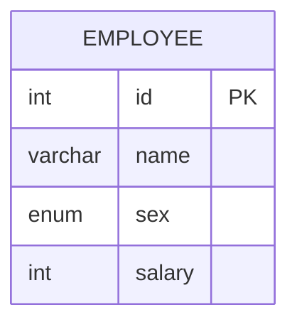

# [leetcode : 627. Swap Salary](https://leetcode.com/problems/swap-salary/description/)

## **다이어그램**


## **목표**

> Write a solution to `swap all 'f' and 'm' values (i.e., change all 'f' values to 'm' and vice versa) with a single update statement and no intermediate temporary tables.`
> `m과 f를 서로 스왑하기`

## **문제 풀이**

### **MySQL**

[tabs: Solution 1, Solution 2]

```sql
-- SOLUTION 1: CASE WHEN
UPDATE SALARY
SET SEX =
    CASE
        WHEN SEX = 'm' THEN 'f'
        ELSE 'm'
    END
```

```sql
-- SOLUTION 2: IF
UPDATE SALARY
SET SEX = IF(SEX='m','f','m')
```

[/tabs]

* SOLUTION 1
  * UPDATE 두 번 써서 바꾸면 한 성별로 바뀌어버리기 때문에 CASE WHEN 사용

* SOLUTION 2
  * IF를 사용해서 더 간결하게 작성

### **Pandas**

[tabs: Solution 1, Solution 2, Solution 3, Solution 4]

```python
# SOLUTION 1: apply
import pandas as pd

def swap_salary(salary: pd.DataFrame) -> pd.DataFrame:
    salary = salary.copy()
    salary['sex'] = salary.apply(lambda x: 'f' if x['sex']=='m' else 'm', axis=1)
    return salary
```

```python
# SOLUTION 2: np.where
import pandas as pd
import numpy as np

def swap_salary(salary: pd.DataFrame) -> pd.DataFrame:
    salary = salary.copy()
    salary['sex'] = np.where(salary['sex']=='m','f','m')
    return salary
```

```python
# SOLUTION 3: map
import pandas as pd

def swap_salary(salary: pd.DataFrame) -> pd.DataFrame:
    salary = salary.copy()
    salary['sex'] = salary['sex'].map({'f': 'm', 'm': 'f'})
    return salary
```

```python
# SOLUTION 4: replace
import pandas as pd

def swap_salary(salary: pd.DataFrame) -> pd.DataFrame:
    salary = salary.copy()
    salary['sex'] = salary['sex'].replace({'f': 'm', 'm': 'f'})
    return salary
```

[/tabs]

* SOLUTION 1
  * apply 사용해서 업데이트

* SOLUTION 2
  * np.where 사용

* SOLUTION 3
  * map 사용

* SOLUTION 4
  * replace 사용
  * str.replace랑은 다르다.
  * replace는 값 치환, str.replace는 문자열 치환 (패턴, 정규식 기반)

## **코멘트**

* 기본 문제
