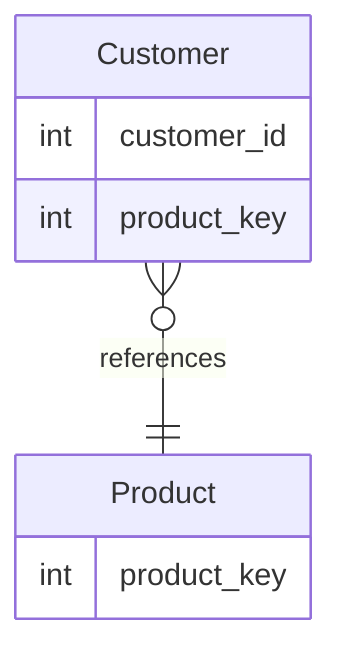

# [leetcode : 1045. Customers Who Bought All Products](https://leetcode.com/problems/customers-who-bought-all-products/description/)

## **다이어그램**


## **목표**

> Write a solution to `report the customer ids from the Customer table that bought all the products in the Product table.`
> `모든 PRODUCT를 구매한 고객 구하기`

## **문제 풀이**

### **MySQL**

[tabs: Solution 1, Solution 2, Solution 3]

```sql
-- SOLUTION 1: DISTINCT + GROUP BY + HAVING
WITH NO_DUP AS (
    SELECT DISTINCT * FROM CUSTOMER
)
SELECT CUSTOMER_ID
FROM (
    SELECT *, COUNT(*) AS CNT
    FROM NO_DUP
    GROUP BY CUSTOMER_ID
    HAVING CNT = (SELECT COUNT(*) FROM PRODUCT)
) AS ALL_PRODUCT
```

```sql
-- SOLUTION 2: LEFT JOIN + GROUP BY + HAVING
WITH TEMP AS (
    SELECT DISTINCT C.CUSTOMER_ID, P.PRODUCT_KEY
    FROM PRODUCT P
    LEFT JOIN CUSTOMER C ON P.PRODUCT_KEY = C.PRODUCT_KEY
)
SELECT CUSTOMER_ID
FROM TEMP
GROUP BY CUSTOMER_ID
HAVING COUNT(*) = (SELECT COUNT(*) FROM PRODUCT)
```

```sql
-- SOLUTION 3
SELECT
    CUSTOMER_ID
FROM
    CUSTOMER
GROUP BY
    CUSTOMER_ID
HAVING
    COUNT(DISTINCT PRODUCT_KEY) = (SELECT COUNT(DISTINCT PRODUCT_KEY) FROM PRODUCT)
```

[/tabs]

* SOLUTION 1
  * HAVING절에 서브쿼리로 비교
  * 조건에 CUSTOMER TABLE에 중복 튜플이 존재할 수 있다고 해서 중복 제거해줘야함

* SOLUTION 2
  * DISTINCT + LEFT JOIN으로 몇개나 겹치는지 확인
  * HAVING으로 PRODUCT 개수랑 맞는지 확인하기

* SOLUTION 3
  * 어렵게 생각할 것 없이 product 테이블에 모든 프로덕트가 있으므로, 각 고객이 가지고 있는 유니크한 프로덕트를 세고 개수를 비교하면 된다.

### **Pandas**

[tabs: Solution 1, Solution 2]

```python
# SOLUTION 1: drop_duplicates + groupby
import pandas as pd

def find_customers(customer: pd.DataFrame, product: pd.DataFrame) -> pd.DataFrame:
    n = len(product)
    customer = customer.drop_duplicates(subset=['customer_id','product_key'])
    count = customer.groupby(['customer_id']).size().reset_index(name='count')
    return count.loc[count['count']==n, ['customer_id']]
```

```python
# SOLUTION 2. 메서드 체이닝
import pandas as pd

def find_customers(customer: pd.DataFrame, product: pd.DataFrame) -> pd.DataFrame:
    total_count = product['product_key'].nunique()
    return (
        customer
        .groupby('customer_id')
        .agg(
            cnt = ('product_key', 'nunique')
        )
        .reset_index()
        .loc[
            lambda df: df['cnt'] == total_count,
            ['customer_id']
        ]
    )

```

[/tabs]

* SOLUTION 1
  * SQL이랑 같은 방법으로 중복제거 후 GROUP BY로 묶어주고 PRODUCT의 튜플수랑 일치하면 정답 반환한다.

* SOLUTION 2
  * 메서드 체이닝으로 중복제거 후 GROUP BY로 묶어주고 PRODUCT의 튜플수랑 일치하면 정답 반환한다.
  * assign을 사용해서 `컬럼명=lambda df ...` 이런 방식으로 할당한 후에, `.loc[]` 조건에서 해당 컬럼을 lambda를 사용하지 않고 불러올 수 있다.

## **코멘트**

* 쉬운 문제
