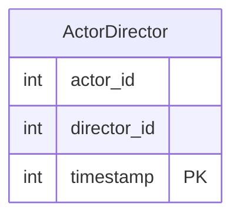

# [leetcode : 1050. Actors and Directors Who Cooperated At Least Three Times](https://leetcode.com/problems/actors-and-directors-who-cooperated-at-least-three-times/description/)

## **다이어그램**


## **목표**

> Write a solution to `find all the pairs (actor_id, director_id) where the actor has cooperated with the director at least three times.`
> `3번 이상 협업한 actor-director 쌍 목록 구하기`

## **문제 풀이**

### **MySQL**

[tabs: Solution 1, Solution 2]

```sql
-- SOLUTION 1: 서브쿼리
SELECT ACTOR_ID, DIRECTOR_ID
FROM (
    SELECT *, COUNT(*) AS CNT
    FROM ActorDirector
    GROUP BY ACTOR_ID, DIRECTOR_ID
    HAVING CNT >= 3
) AS OVER_THREE
```

```sql
-- SOLUTION 2: GROUP BY + HAVING
SELECT
    ACTOR_ID, DIRECTOR_ID
FROM
    ActorDirector 
GROUP BY
    ACTOR_ID, DIRECTOR_ID
HAVING
    COUNT(*) >= 3
```

[/tabs]

* SOLUTION 1
  * 서브쿼리 사용

* SOLUTION 2
  * 서브쿼리 없이 바로 HAVING절에서 처리

### **Pandas**

[tabs: Solution 1, Solution 2, Solution 3]

```python
# SOLUTION 1: size
import pandas as pd

def actors_and_directors(actor_director: pd.DataFrame) -> pd.DataFrame:
    count = actor_director.groupby(['actor_id','director_id']).size().reset_index(name='count')
    return count.loc[count['count']>=3, ['actor_id','director_id']]
```

```python
# SOLUTION 2: count
import pandas as pd

def actors_and_directors(actor_director: pd.DataFrame) -> pd.DataFrame:
    df = actor_director.groupby(['actor_id', 'director_id']).count().reset_index().rename(columns={'timestamp': 'count'})
    return df.loc[df['count']>=3, ['actor_id', 'director_id']]
```

```python
import pandas as pd

def actors_and_directors(actor_director: pd.DataFrame) -> pd.DataFrame:
    return (
        actor_director
        .groupby(by=['actor_id','director_id'])
        .agg(
            cnt = ('timestamp','size')
        )
        .reset_index()
        .loc[
            lambda row: row['cnt'] >= 3,
            ['actor_id','director_id']
        ]
    )
```

[/tabs]

* SOLUTION 1
  * size는 시리즈 반환, count는 데이터 프레임을 반환한다.
  * size는 시리즈 컬럼명이 없기 때문에 바로 name을 할당 가능하다.

* SOLUTION 2
  * count는 데이터프레임 컬럼명이 있어서 reset_index를 하면 남아있는 집계 컬럼 timestamp에 카운팅이 되고, 이를 count로 바꿔준다.
  * size와 count의 차이: null값 포함 미포함 유무 이외에 name 할당에서 차이가 있다.

## **코멘트**

* 쉬운 문제
