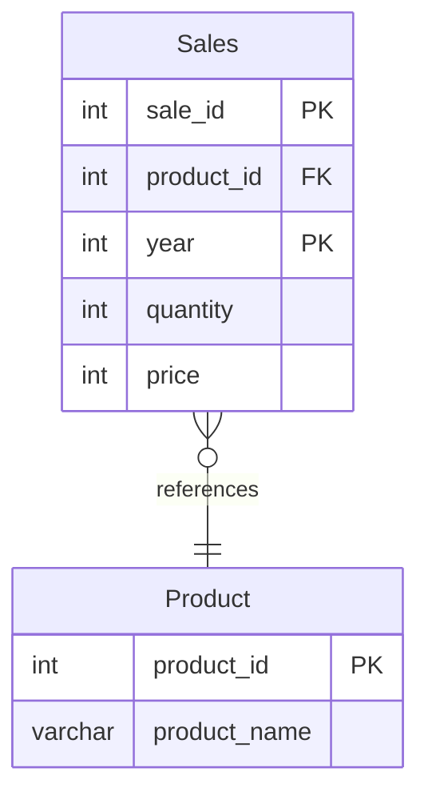

# [leetcode : 1068. Product Sales Analysis I](https://leetcode.com/problems/product-sales-analysis-i/description/)

## **다이어그램**


## **목표**

> Write a solution to `report the product_name, year, and price for each sale_id in the Sales table.`
> `각 판매의 제품명, 연도, 가격 구하기`

## **문제 풀이**

### **MySQL**

[tabs: Solution 1, Solution 2]

```sql
-- SOLUTION 1: JOIN
SELECT P.PRODUCT_NAME, S.YEAR, S.PRICE
FROM SALES AS S
JOIN PRODUCT AS P ON S.PRODUCT_ID = P.PRODUCT_ID
```

```sql
-- SOLUTION 2
SELECT
    P.PRODUCT_NAME,
    S.YEAR,
    S.PRICE
FROM
    PRODUCT AS P
JOIN
    SALES AS S
    ON P.PRODUCT_ID = S.PRODUCT_ID
ORDER BY S.YEAR
```

[/tabs]

* SOLUTION 1
  * 조인해주고 컬럼 선택해서 뽑아주기.

* SOLUTION 2
  * 둘이 똑같은데 AC 안걸려있거나 순서가 보장 안되어있으면 정렬이 필요하다.
  * LEFT JOIN은 피벗 테이블인 PRODUCT 테이블과 조인할 때 NULL 발생시킬 수 있어서 ISNULL 처리가 필요해서 JOIN을 사용한다.

### **Pandas**

[tabs: Solution 1, Solution 2]

```python
# SOLUTION 1: merge + how='left'
import pandas as pd

def sales_analysis(sales: pd.DataFrame, product: pd.DataFrame) -> pd.DataFrame:
    join = sales.merge(product, on='product_id', how='left')
    return join.loc[:, ['product_name','year','price']]
```

```python
# SOLUTION 2: merge (inner join)
import pandas as pd

def sales_analysis(sales: pd.DataFrame, product: pd.DataFrame) -> pd.DataFrame:
    merged = pd.merge(sales, product, on='product_id')
    return merged.loc[:, ['product_name','year','price']]
```

```python
# SOLUTION 3: 메서드 체이닝
import pandas as pd

def sales_analysis(sales: pd.DataFrame, product: pd.DataFrame) -> pd.DataFrame:
    return (
        product
        .merge(
            sales, on='product_id'
        )
        .loc[
            :,['product_name','year','price']
        ]
    )
```

[/tabs]

* SOLUTION 1
  * join을 한 테이블을 만들어주고 원하는 컬럼만 뽑는 문제
  * on에 공통 컬럼 안적어도 되는데, 기준이 없으면 테이블 컬럼에 접근 후 탐색해서 시간이 추가적으로 걸린다.
  * 웬만하면 컬럼에 조인 컬럼 명시해주기.

* SOLUTION 2
  * how를 적지 않은 경우 inner join이 기본값
  * 모든 컬럼을 가져와서 메모리적으로 손해가 있다.

* SOLUTION 3
  * 단순 join 이후 loc 사용.

## **코멘트**

* 쉬운 문제
