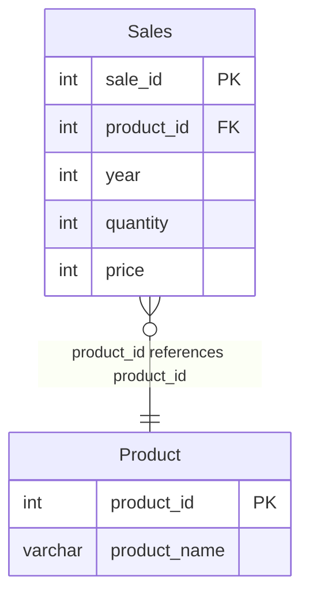

# [leetcode : 1070. Product Sales Analysis III](https://leetcode.com/problems/product-sales-analysis-iii/description/)

## **다이어그램**



## **목표**

> Write a solution to `select the product id, year, quantity, and price for the first year of every product sold.`
> `각 제품의 첫 판매 연도 정보 불러오기`

## **문제 풀이**

### **MySQL**

[tabs: Solution 1]

```sql
-- SOLUTION 1: JOIN + 서브쿼리
SELECT S.PRODUCT_ID, S.YEAR AS FIRST_YEAR, S.QUANTITY, S.PRICE
FROM SALES AS S
JOIN (
    SELECT PRODUCT_ID, MIN(YEAR) AS FIRST_YEAR
    FROM SALES
    GROUP BY PRODUCT_ID
) TEMP
ON S.PRODUCT_ID = TEMP.PRODUCT_ID AND S.YEAR = TEMP.FIRST_YEAR;
```

[/tabs]

* SOLUTION 1
  * 각 상품별 가장 작은 YEAR을 뽑아내는 TEMP 쿼리를 작성한다.
  * 원래 있던 SALES와 다시 PRODUCT ID로 JOIN 시켜주면 끝.

### **Pandas**

[tabs: Solution 1, Solution 2]

```python
# SOLUTION 1: groupby + merge
import pandas as pd

def sales_analysis(sales: pd.DataFrame, product: pd.DataFrame) -> pd.DataFrame:
    grouped = sales.groupby('product_id')['year'].agg('min').reset_index()
    answer = pd.merge(sales, grouped, on=['product_id','year'], how='inner')
    answer.rename(columns={'year':'first_year'}, inplace=True)
    return answer.loc[:, ['product_id','first_year','quantity','price']]
```

```python
# SOLUTION 2: sort_values + drop_duplicates
import pandas as pd

def sales_analysis(sales: pd.DataFrame, product: pd.DataFrame) -> pd.DataFrame:
    sales = sales.sort_values(by=['product_id','year'], ascending=[True,True])
    sales = sales.drop_duplicates(subset=['product_id'], keep='first')
    sales.rename(columns={'year':'first_year'}, inplace=True)
    return sales.loc[:, ['product_id','first_year','quantity','price']]
```

```python
# SOLUTION 3. 메서드 체이닝
import pandas as pd

def sales_analysis(sales: pd.DataFrame) -> pd.DataFrame:
    return (
        sales
        .assign(first_year=lambda df: df.groupby('product_id')['year'].transform('min'))
        .loc[
            lambda df: df['year'] == df['first_year'],
            ['product_id', 'first_year', 'quantity', 'price']
        ]
    )
```

[/tabs]

* SOLUTION 1
  * product_id에 대해서 groupby 진행하고, year에 대해서 agg 진행하기.
  * join을 통해서 조건에 맞는 row를 sales에서 꺼내온다.

* SOLUTION 2
  * 정렬 후 프로덕트의 가장 작은 년도만 불러오기.
  * sort_values + drop_duplicates로 처리

* SOLUTION 3
  * 최소 연도 태그를 transform + assign으로 생성하고, year와 비교하여 필터링

## **코멘트**

* 기본 문제
