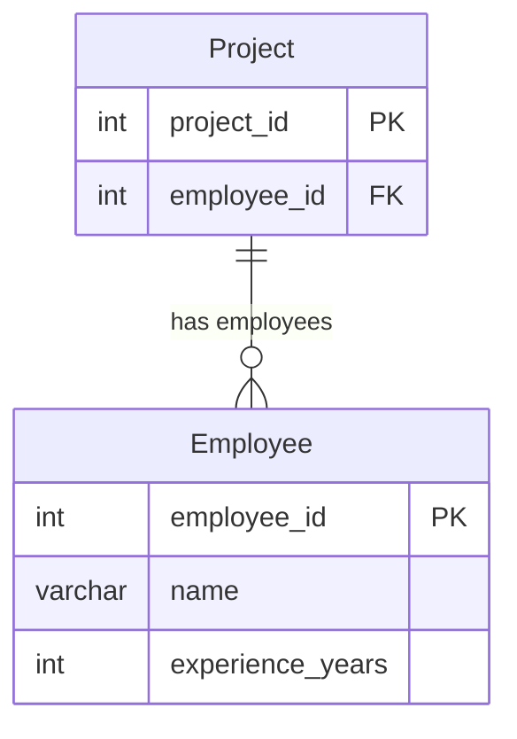

# [leetcode : 1075. Project Employees I](https://leetcode.com/problems/project-employees-i/description/)

## **다이어그램**


## **목표**

> Write a solution to `report the average experience years of all the employees for each project, rounded to 2 digits.`
> `프로젝트별 평균 근속년수 구하기 (소수점 2자리)`

## **문제 풀이**

### **MySQL**

[tabs: Solution 1]

```sql
-- SOLUTION 1: JOIN + GROUP BY
SELECT
    P.PROJECT_ID,
    ROUND(AVG(EXPERIENCE_YEARS),2) AS AVERAGE_YEARS
FROM
    PROJECT AS P
JOIN
    EMPLOYEE AS E
    ON P.EMPLOYEE_ID = E.EMPLOYEE_ID
GROUP BY
    P.PROJECT_ID  
```

[/tabs]

* SOLUTION 1
  * 서브쿼리에서 JOIN을 통해서 PROJECT에 투입된 사람의 연차가 얼마인지 모두 구한다.
  * PROJECT별로 GROUP BY + AVG를 진행한다.

### **Pandas**

[tabs: Solution 1, Solution 2, Solution 3]

```python
# SOLUTION 1: agg 딕셔너리
import pandas as pd

def project_employees_i(project: pd.DataFrame, employee: pd.DataFrame) -> pd.DataFrame:
    join = pd.merge(project, employee, on='employee_id')
    answer = join.groupby('project_id').agg({'experience_years': 'mean'}).reset_index()
    answer.rename(columns={'experience_years':'average_years'}, inplace=True)
    answer['average_years'] = answer['average_years'].round(2)
    return answer.loc[:, ['project_id','average_years']]
```

```python
# SOLUTION 2: agg 튜플
import pandas as pd

def project_employees_i(project: pd.DataFrame, employee: pd.DataFrame) -> pd.DataFrame:
    merged = pd.merge(project, employee, on='employee_id')
    grouped = merged.groupby('project_id').agg(
        average_years = ('experience_years','mean')
    ).reset_index()
    grouped['average_years'] = grouped['average_years'].round(2)
    return grouped.loc[:, ['project_id','average_years']]
```

```python
# SOLUTION 3. 메서드 체이닝.
import pandas as pd

def project_employees_i(project: pd.DataFrame, employee: pd.DataFrame) -> pd.DataFrame:
    return (
        project
        .merge(
            employee, on='employee_id'
        )
        .groupby('project_id')
        .agg(
            average_years=('experience_years', lambda x: round(x.mean(),2))
        )
        .reset_index()
        # .assign(average_years=lambda df: df['average_years'].round(2)) # agg에서 mean 사용하는 경우
        .loc[
            :,
            ['project_id','average_years']
        ]
    )
```

[/tabs]

* SOLUTION 1
  * 같은 방식으로 join을 통해서 project에 투입된 사람의 연차를 모두 매칭시킨다.
  * agg를 통해서 평균값을 모두 구해주고 컬럼명, 포매팅 해주면 끝

  * agg를 다른 방식으로 할당할 수 있다.
  * 새로운 컬럼명을 지정하면서 변환시킬 때, 딕셔너리 말고 할당 + 튜플로 전달해주면 된다.
  * 다중 컬럼에 대해서 다중 집계를 할 때, sol1 처럼 key = [agg1, agg2] 이런식으로 쓰는게 더 낫긴 하다.

* SOLUTION 3
  * 메서드 체이닝
  * agg에서 콜러블하게 lambda로 넣으면 내부에서 `C/Numpy`로 최적회가 안돼서 `'mean'`으로 넣어주고 assign을 하는게 더 빠르다고 한다.

## **코멘트**

* 기본 문제
