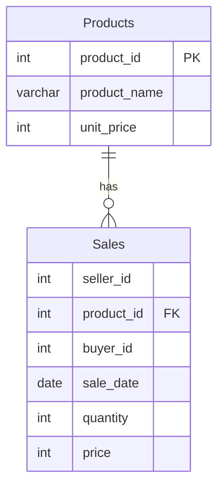

# [leetcode : 1084. Sales Analysis III](https://leetcode.com/problems/sales-analysis-iii/description/)

## **다이어그램**



## **목표**

> Write a solution to `report the products that were only sold in the first quarter of 2019. That is, between 2019-01-01 and 2019-03-31 inclusive.`
> `2019년 1분기에만 판매된 제품 구하기`

## **문제 풀이**

### **MySQL**

[tabs: Solution 1, Solution 2, Solution 3]

```sql
-- SOLUTION 1: JOIN + MIN/MAX
SELECT P.PRODUCT_ID, P.PRODUCT_NAME
FROM PRODUCT AS P
JOIN (
    SELECT PRODUCT_ID, MIN(SALE_DATE) AS MIN_DATE, MAX(SALE_DATE) AS MAX_DATE
    FROM SALES
    GROUP BY PRODUCT_ID
) AS T
ON P.PRODUCT_ID = T.PRODUCT_ID
WHERE T.MIN_DATE >= '2019-01-01' AND T.MAX_DATE <= '2019-03-31';
```

```sql
-- SOLUTION 2: CTE + IN
WITH Q1 AS (
    SELECT PRODUCT_ID
    FROM SALES
    GROUP BY PRODUCT_ID
    HAVING MIN(SALE_DATE) >= '2019-01-01' AND MAX(SALE_DATE) <= '2019-03-31'
)
SELECT PRODUCT_ID, PRODUCT_NAME
FROM PRODUCT
WHERE PRODUCT_ID IN (SELECT PRODUCT_ID FROM Q1)
```

```sql
-- SOLUTION 3: JOIN + MIN/MAX
SELECT
    P.PRODUCT_ID,
    P.PRODUCT_NAME
FROM
    PRODUCT AS P
JOIN
    (
        SELECT
            PRODUCT_ID
        FROM
            SALES
        GROUP BY
            PRODUCT_ID
        HAVING
            MIN(SALE_DATE) >= '2019-01-01'
            AND MAX(SALE_DATE) <= '2019-03-31'
    ) AS Q1
    ON P.PRODUCT_ID = Q1.PRODUCT_ID
```

[/tabs]

* SOLUTION 1
  * 각 상품의 DATE의 MIN MAX를 구한 후, 이 테이블과 조인한다.
  * 이후 날짜만 체크해주면 끝.

* SOLUTION 2
  * CTE 만들어서 IN 사용해주기.

### **Pandas**

[tabs: Solution 1, Solution 2]

```python
# SOLUTION 1: groupby + agg + merge
import pandas as pd

def sales_analysis(product: pd.DataFrame, sales: pd.DataFrame) -> pd.DataFrame:
    grouped = sales.groupby('product_id').agg(
        min_date = ('sale_date','min'),
        max_date = ('sale_date','max')
    ).reset_index()
    q1 = grouped[(grouped['min_date']>='2019-01-01') & (grouped['max_date']<='2019-03-31')]
    answer = pd.merge(product, q1, on='product_id')
    return answer.loc[:, ['product_id','product_name']]
```

```python
# SOLUTION 2: 메서드 체이닝
import pandas as pd

def sales_analysis(product: pd.DataFrame, sales: pd.DataFrame) -> pd.DataFrame:
    return (
        sales
        .groupby('product_id')
        .agg(
            first_date = ('sale_date','min'),
            last_date = ('sale_date','max')
        )
        .reset_index()
        .merge(
            product, on='product_id'
        )
        .loc[
            lambda df: (df['first_date'] >= '2019-01-01') & (df['last_date'] <= '2019-03-31'),
            ['product_id','product_name']
        ]
    )
```

[/tabs]

* SOLUTION 1
  * SQL과 같은 방식으로 grouped 테이블을 만들어서 날짜의 최대 최소를 구한다.
  * JOIN 시켜준 후, 날짜 체크해주기

## **코멘트**

* 코드들 보면 대체로 inner join 사용하는 코드들이 성능이 높은 것 같다.
* agg에 딕셔너리로 전달하기 보다는, 컬럼명을 미리 지정하고 튜플로 전달하는게 더 나은 듯
* 다른 사람들 보니까, 조건 만족하는 id만 구해놓고 isin으로 푸는 풀이도 많이 보인다.
