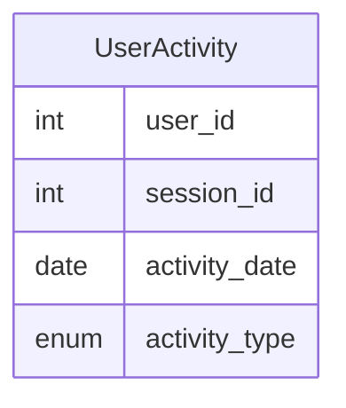

# [leetcode : 1141. User Activity for the Past 30 Days I](https://leetcode.com/problems/user-activity-for-the-past-30-days-i/description/)

## **다이어그램**



## **목표**

> Write a solution to `find the daily active user count for a period of 30 days ending 2019-07-27 inclusively. A user was active on some day if they made at least one activity on that day.`
> `2019-07-27을 포함한 과거 30일간의 일일 활성 사용자 수 구하기`

## **문제 풀이**

### **MySQL**

[tabs: Solution 1, Solution 2]

```sql
-- SOLUTION 1: GROUP BY + DATE_SUB
WITH GROUPED AS (
    SELECT ACTIVITY_DATE AS `DAY`, COUNT(DISTINCT USER_ID) AS ACTIVE_USERS
    FROM ACTIVITY
    GROUP BY ACTIVITY_DATE
)
SELECT *
FROM GROUPED
WHERE `DAY` BETWEEN DATE_SUB('2019-07-27', INTERVAL 29 DAY) AND '2019-07-27'
```

```sql
-- SOLUTION 2: Simple GROUP BY
SELECT
    ACTIVITY_DATE AS 'DAY',
    COUNT(DISTINCT USER_ID) AS ACTIVE_USERS
FROM
    ACTIVITY
WHERE
    ACTIVITY_DATE BETWEEN DATE_SUB('2019-07-27', INTERVAL 29 DAY) AND '2019-07-27'
GROUP BY
    ACTIVITY_DATE
```

[/tabs]

* SOLUTION 1
  * GROUP BY DISTINCT로 날짜 별 인원을 구해준다.
  * DATE_ADD/SUB로 시작날짜 구해주기

* SOLUTION 2
  * CTE 없이 단순 GROUP BY와 WHERE 필터링을 사용하여 해결.
  * date diff/sub 구할 때 순서 주의하기.

### **Pandas**

[tabs: Solution 1, Solution 2, Solution 3]

```python
# SOLUTION 1: 날짜 필터 후 groupby
import pandas as pd
from datetime import timedelta

def user_activity(activity: pd.DataFrame) -> pd.DataFrame:
    end = pd.to_datetime('2019-07-27')
    start = end - timedelta(days=29)
    temp = activity[activity['activity_date'].between(start,end)]
    answer = (temp.groupby('activity_date').agg(
        active_users=('user_id','nunique'))
        .reset_index()
        .rename(columns={'activity_date':'day'}))
    return answer
```

```python
# SOLUTION 2: groupby 후 날짜 필터
import pandas as pd
from datetime import timedelta

def user_activity(activity: pd.DataFrame) -> pd.DataFrame:
    end = pd.to_datetime('2019-07-27')
    start = end - timedelta(days=29)
    grouped = activity.groupby('activity_date').agg(
        active_users=('user_id','nunique')
    ).reset_index()
    return grouped.loc[grouped['activity_date'].between(start,end)].rename(columns={'activity_date':'day'})
```

```python
# SOLUTION 3: Lambda + chaining
import pandas as pd

def user_activity(activity: pd.DataFrame) -> pd.DataFrame:
    return (
        activity
        .loc[
            lambda x: x['activity_date'].between(
                pd.to_datetime('2019-07-27') - pd.Timedelta(days=29), 
                pd.to_datetime('2019-07-27')
            )
        ]
        .groupby('activity_date')
        .agg(
            active_users=('user_id', 'nunique'))
        .reset_index()
        .rename(columns={'activity_date': 'day'})
    )
```

[/tabs]

* SOLUTION 1
  * 같은 방식으로 날짜 29일을 빼주고 between 적용
  * agg 집계함수에 nunique를 써준다.
  * count + distinct 느낌

* SOLUTION 2
  * 먼저 group에 unique를 하고 날짜 조건을 걸어주면 조금 더 빠르게 풀 수 있다.

* SOLUTION 3
  * 메서드 체이닝과 람다 함수를 활용하여 가독성을 높인 풀이.

## **코멘트**

* 날짜는 실제 데이터에서 자주 나와서 기억해야함
* DATE_ADD/SUB, timedelta
* DATEDIFF(date1, date2), TIMESTAMPDIFF(unit, datetime1, datetime2) 차이구하기 가능
