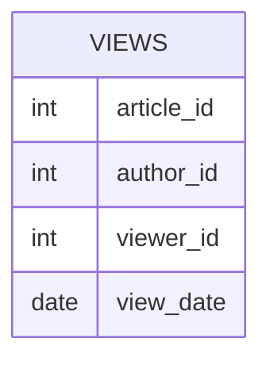

# [leetcode : 1148. Article Views I](https://leetcode.com/problems/article-views-i/description/)

## **다이어그램**


## **목표**

> Write a solution to `find all the authors that viewed at least one of their own articles.`
> `자신의 논문을 본 저자 구하기`

## **문제 풀이**

### **MySQL**

[tabs: Solution 1]

```sql
-- SOLUTION 1: DISTINCT
SELECT DISTINCT(AUTHOR_ID) AS ID
FROM VIEWS
WHERE AUTHOR_ID = VIEWER_ID
ORDER BY ID ASC
```

[/tabs]

* SOLUTION 1
  * DISTINCT로 중복값 제거하기

### **Pandas**

[tabs: Solution 1, Solution 2]

```python
# SOLUTION 1: drop_duplicates + 조건
import pandas as pd

def article_views(views: pd.DataFrame) -> pd.DataFrame:
    droped = views.drop_duplicates(subset=['author_id','viewer_id'], keep='first')
    answer = droped.loc[droped['author_id']==droped['viewer_id'], ['author_id']]
    return answer.rename(columns={'author_id':'id'}).sort_values('id')
```

```python
# SOLUTION 2: lambda + chaining
import pandas as pd

def article_views(views: pd.DataFrame) -> pd.DataFrame:
    return (
        views.loc[
            lambda row: row['author_id'] == row['viewer_id'],
            ['author_id']
        ]
        .rename(columns={'author_id':'id'})
        .drop_duplicates(subset='id')
        .sort_values(by='id', ascending=True)
    )
```

[/tabs]

* SOLUTION 1
  * 마찬가지로 rename, sort_values, drop_duplicates 써주기.

* SOLUTION 2
  * lambda 함수와 메서드 체이닝을 활용하여 가독성을 높인 풀이.

## **코멘트**

* 쉬운 문제
