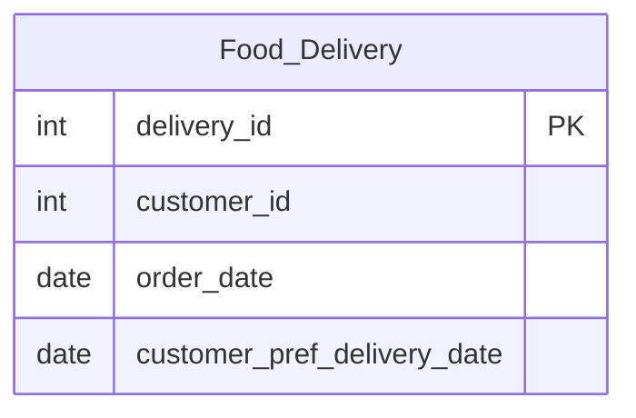

# [leetcode : 1174. Immediate Food Delivery II](https://leetcode.com/problems/immediate-food-delivery-ii/description/)

## **다이어그램**


## **목표**

> Write a solution to `find the percentage of immediate orders in the first orders of all customers, rounded to 2 decimal places.`
> `모든 고객의 첫 주문 중 당일 배송 상품의 비율 구하기`

## **문제 풀이**

* 첫 주문을 찾기 위해서는 유저별로 주문날짜, 배송날짜의 최소값을 가져온다.
* 그 중에서 주문날짜=배송날짜인 것을 찾는다.
* 전체 주문 수와 주문날짜=배송날짜인 것의 비율을 구한다.

### **MySQL**

[tabs: Solution 1, Solution 2]

```sql
-- SOLUTION 1: CTE + COUNT
WITH temp AS (
    SELECT *, MIN(order_date) AS d1, MIN(customer_pref_delivery_date) AS d2
    FROM delivery
    GROUP BY customer_id
),
cnt_filtered AS (
    SELECT *, COUNT(*) AS cnt_f
    FROM temp
    WHERE d1 = d2
),
cnt_all AS (
    SELECT *, COUNT(*) AS cnt_a
    FROM temp
)
SELECT ROUND(100*cnt_f/cnt_a,2) AS immediate_percentage 
FROM cnt_all, cnt_filtered
```

```sql
-- SOLUTION 2: LEFT JOIN
WITH TEMP AS (
    SELECT
        CUSTOMER_ID,
        MIN(ORDER_DATE) AS FIRST_DATE
    FROM DELIVERY
    GROUP BY CUSTOMER_ID
)
SELECT ROUND(100*COUNT(D.CUSTOMER_ID)/COUNT(*),2) AS IMMEDIATE_PERCENTAGE
FROM TEMP T
LEFT JOIN DELIVERY D ON T.CUSTOMER_ID = D.CUSTOMER_ID AND T.FIRST_DATE = D.CUSTOMER_PREF_DELIVERY_DATE
```

[/tabs]

* SOLUTION 1
  * 각 유저별로 첫 주문을 가져오면 된다.
  * 주문 날짜, 발송 날짜의 최소값이 서로 같은 쿼리를 찾는다.
  * 두 테이블의 row를 count로 세주고 round

* SOLUTION 2
  * 유저의 첫 주문만 가져온 후, 원본 테이블과 LEFT JOIN을 진행한다.
  * ID + 첫주문이 일치하지 않으면, NULL값으로 나와서 전체 행과 그렇지 않은 행 비율을 구해주면 된다.

### **Pandas**

[tabs: Solution 1, Solution 2]

```python
# SOLUTION 1: groupby + agg + np.where
import pandas as pd
import numpy as np

def immediate_food_delivery(delivery: pd.DataFrame) -> pd.DataFrame:
    grouped = delivery.groupby('customer_id').agg(
        first_date = ('order_date','min'),
        pref_date = ('customer_pref_delivery_date','min')
    ).reset_index()
    grouped['immediate'] = np.where(grouped['first_date']==grouped['pref_date'],1,0)
    return pd.DataFrame({'immediate_percentage':[round(100*grouped['immediate'].sum()/len(grouped),2)]})
```

```python
# SOLUTION 2: groupby + min
import pandas as pd

def immediate_food_delivery(delivery: pd.DataFrame) -> pd.DataFrame:
    grouped = delivery.groupby('customer_id').min().reset_index()
    cond = grouped['order_date']==grouped['customer_pref_delivery_date']
    ratio = (len(grouped[cond])/len(grouped['customer_id']))*100
    return pd.DataFrame({'immediate_percentage': [round(ratio,2)]})
```

[/tabs]

* SOLUTION 1
  * groupby + agg로 위 풀이랑 비슷하게 주문날짜, 배송날짜의 min값을 가져온다.
  * pandas에서는 len으로 바로 처리한다.

* SOLUTION 2
  * 유저의 첫 주문만 가져온 후, 동일날짜 조건을 데이터 길이를 확인한다.

## **코멘트**

* group by에서 지정 안하면 첫 행 데이터 가져오는 것을 명심하고 쿼리 작성하기.
