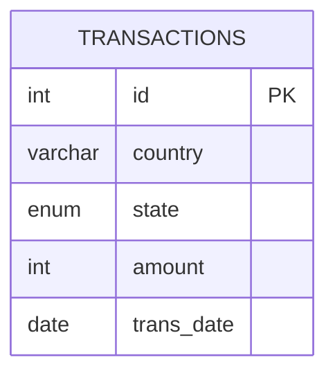

# [leetcode : 1193. Monthly Transactions I](https://leetcode.com/problems/monthly-transactions-i/description/)

## **다이어그램**


## **목표**

> Write a solution to `find for each month and country, the number of transactions and their total amount, the number of approved transactions and their total amount.`
> `월별, 국가별 거래 수와 총액, 승인된 거래 수와 총액 구하기`

## **문제 풀이**

### **MySQL**

[tabs: Solution 1, Solution 2, Solution 3, Solution 4]

```sql
-- SOLUTION 1: CTE + LEFT JOIN
WITH tr_all AS (
    SELECT CONCAT(YEAR(trans_date),'-',LPAD(MONTH(trans_date),2,'0')) AS month, country,
        COUNT(*) AS trans_count, SUM(amount) AS trans_total_amount
    FROM transactions
    GROUP BY CONCAT(YEAR(trans_date),'-',MONTH(trans_date)), country
),
tr_approved AS (
    SELECT CONCAT(YEAR(trans_date),'-',LPAD(MONTH(trans_date),2,'0')) AS month, country,
        COUNT(*) AS approved_count, SUM(amount) AS approved_total_amount
    FROM transactions
    WHERE state = 'approved'
    GROUP BY CONCAT(YEAR(trans_date),'-',MONTH(trans_date)), country
)
SELECT A.month, A.country,
    A.trans_count, COALESCE(B.approved_count,0) AS approved_count,
    A.trans_total_amount, COALESCE(B.approved_total_amount,0) AS approved_total_amount
FROM tr_all AS A
LEFT JOIN tr_approved AS B ON A.month = B.month AND A.country = B.country
```

```sql
-- SOLUTION 2: CTE + COUNT IF
WITH TEMP AS (
    SELECT COUNTRY, STATE, AMOUNT, IF(STATE='approved', AMOUNT, 0) AS AMOUNT_COND, TRANS_DATE
    FROM TRANSACTIONS
)
SELECT
    DATE_FORMAT(TRANS_DATE, '%Y-%m') AS `month`,
    COUNTRY AS `country`,
    COUNT(*) AS `trans_count`,
    COUNT(IF(STATE='approved', 1, NULL)) AS `approved_count`,
    SUM(AMOUNT) AS `trans_total_amount`,
    SUM(AMOUNT_COND) AS `approved_total_amount`
FROM TEMP
GROUP BY DATE_FORMAT(TRANS_DATE, '%Y-%m'), COUNTRY
```

```sql
-- SOLUTION 3: COUNT IF (1등 풀이)
SELECT
    DATE_FORMAT(trans_date, '%Y-%m') AS month,
    country,
    COUNT(*) AS trans_count,
    COUNT(IF(state = 'approved', 1, NULL)) AS approved_count,
    SUM(amount) AS trans_total_amount,
    SUM(IF(state = 'approved', amount, 0)) AS approved_total_amount
FROM Transactions
GROUP BY month, country
```

```sql
-- SOLUTION 4: 조건식 직접 사용
SELECT  
    CONCAT(YEAR(trans_date),'-',LPAD(MONTH(trans_date),2,'0')) AS month,
    country, 
    COUNT(*) AS trans_count, 
    SUM(state = 'approved') AS approved_count,
    SUM(amount) AS trans_total_amount, 
    SUM((state = 'approved') * amount) AS approved_total_amount
FROM transactions
GROUP BY CONCAT(YEAR(trans_date),'-',LPAD(MONTH(trans_date),2,'0')), country
```

[/tabs]

* SOLUTION 1
  * CTE로 일단 전체 값, approved 값을 이용해서 만든 테이블을 조인했다.
  * 처음에는 이렇게 풀었는데, test case 15에서 country에 null값이 포함된거를 처리하지 못해서 틀렸음.

* SOLUTION 2
  * CTE로 승인유무에 따른 컬럼을 생성해준다.
  * 본 쿼리에서 COUNT IF, COUNT * 등을 활용해서 카운팅.

* SOLUTION 3
  * 1등 풀이
  * COUNT IF 로 풀이, CTE없이 바로 더미컬럼 생성해서 계산했다.

* SOLUTION 4
  * best solution을 보고 이런식으로 풀었다.
  * select에 서브쿼리 사용 못한다는 생각때문에, 저런식으로 조건문으로 T/F를 반환하는 식으로 풀이하는 방법은 생각못했다.
  * 어쨋든 T/F결과를 합하거나 값에 가격을 곱해서 구하는 식으로 풀이.

### **Pandas**

[tabs: Solution 1, Solution 2]

```python
# SOLUTION 1: fillna 처리
import pandas as pd
import numpy as np

def monthly_transactions(transactions: pd.DataFrame) -> pd.DataFrame:
    transactions = transactions.copy()
    transactions['country'] = transactions['country'].fillna('null')
    transactions['month'] = transactions['trans_date'].dt.strftime('%Y-%m')
    transactions['amount_state'] = np.where(transactions['state']=='approved',transactions['amount'],None)
    grouped = transactions.groupby(['month','country']).agg(
        trans_count = ('amount','size'),
        approved_count = ('amount_state','count'),
        trans_total_amount = ('amount','sum'),
        approved_total_amount  = ('amount_state','sum')
    ).reset_index()
    grouped['country'] = np.where(grouped['country']=='null',None,grouped['country'])
    return grouped
```

```python
# SOLUTION 2: dropna=False
import pandas as pd
import numpy as np

def monthly_transactions(transactions: pd.DataFrame) -> pd.DataFrame:
    transactions = transactions.copy()
    transactions['month'] = transactions['trans_date'].dt.strftime('%Y-%m')
    transactions['amount_state'] = np.where(transactions['state']=='approved',transactions['amount'],None)
    grouped = transactions.groupby(['month','country'], dropna=False).agg(
        trans_count = ('amount','size'),
        approved_count = ('amount_state','count'),
        trans_total_amount = ('amount','sum'),
        approved_total_amount  = ('amount_state','sum')
    ).reset_index()
    return grouped
```

[/tabs]

* SOLUTION 1
  * null값으로 group by 안돼서 예외처리를 fillna로 한 후, 마지막에 다시 null로 바꿔줬다.
  * 찾아보니까 dropna=False로 설정하면 더 간단하게 묶을 수 있다.

* SOLUTION 2
  * dropna=False를 사용한 방법

## **코멘트**

* 집계 전에 컬럼을 만들어줘서 count, sum 등에서 부분만 포함되도록 조건을 걸어줄 수 있다.
