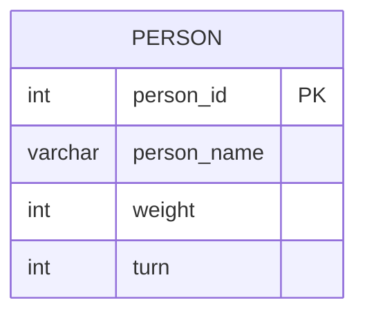

# [leetcode : 1204. Last Person to Fit in the Bus](https://leetcode.com/problems/last-person-to-fit-in-the-bus/description/)

## **다이어그램**


## **목표**

> Write a solution to `find the person_name of the last person who can fit on the bus without exceeding the weight limit. The test cases are generated such that the first person does not exceed the weight limit.`
> `무게 제한을 초과하지 않고 버스에 탈 수 있는 마지막 사람의 이름 구하기`

## **문제 풀이**

### **MySQL**

[tabs: Solution 1]

```sql
-- SOLUTION 1: 윈도우 함수 + 누적합
WITH ORDERED AS (
    SELECT
        PERSON_NAME,
        SUM(WEIGHT) OVER (ORDER BY TURN) AS TOTAL_WEIGHT
    FROM QUEUE
)
SELECT PERSON_NAME
FROM ORDERED
WHERE TOTAL_WEIGHT <= 1000
ORDER BY TOTAL_WEIGHT DESC
LIMIT 1
```

[/tabs]

* SOLUTION 1
  * 윈도우 함수를 사용해서 문제풀이.
  * weight에 누적합을 적용하고 대기 순서 turn으로 정렬을 걸어준다.
  * 누적합이 1000이 넘지 않는 사람들의 쿼리를 역순을 정렬하고 하나 뽑아주기.

### **Pandas**

[tabs: Solution 1]

```python
# SOLUTION 1: sort_values + cumsum
import pandas as pd

def last_passenger(queue: pd.DataFrame) -> pd.DataFrame:
    ordered = queue.sort_values('turn')
    ordered['total_weight'] = ordered['weight'].cumsum()
    answer = ordered[ordered['total_weight']<=1000]
    return answer.loc[:, ['person_name']].tail(1)
```

[/tabs]

* SOLUTION 1
  * SQL처럼 한 번에 정렬 + 누적합은 불가능해서 두 번 나눠서 풀이.
  * 정렬 이후에 cumsum으로 누적합을 구해준다.
  * iloc대신 tail 또는 head를 사용해서 앞에 있는 데이터프레임을 추출하기.

## **코멘트**

* 기본 문제
