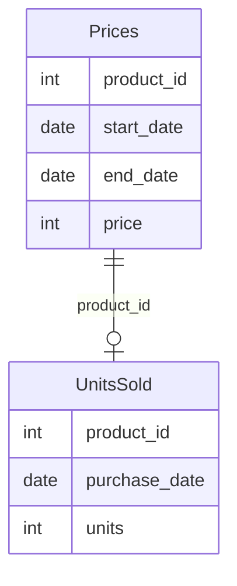

# [leetcode : 1251. Average Selling Price](https://leetcode.com/problems/average-selling-price/description/)

## **다이어그램**


## **목표**

> Write a solution to `find the average selling price for each product. average_price should be rounded to 2 decimal places.`
> `각 제품의 평균 판매 가격 구하기 (날짜마다 상품의 가격이 달라지므로 구매 날짜에 맞는 가격으로 계산)`

## **문제 풀이**

### **MySQL**

[tabs: Solution 1, Solution 2]

```sql
-- SOLUTION 1: JOIN + UNION
SELECT p.product_id, ROUND(SUM(p.price*u.units)/SUM(u.units),2) AS average_price
FROM prices AS p
JOIN unitssold AS u ON p.product_id = u.product_id
WHERE u.purchase_date BETWEEN p.start_date AND p.end_date
GROUP BY p.product_id

UNION

SELECT product_id, 0
FROM prices
WHERE product_id NOT IN (SELECT product_id FROM unitssold)
```

```sql
-- SOLUTION 2: CTE + LEFT JOIN
WITH TEMP AS (
    SELECT
        P.PRODUCT_ID,
        ROUND(SUM(PRICE*UNITS)/SUM(UNITS),2) AS AVERAGE_PRICE
    FROM PRICES P 
    JOIN UNITSSOLD U ON
        P.PRODUCT_ID = U.PRODUCT_ID AND
        U.PURCHASE_DATE BETWEEN P.START_DATE AND P.END_DATE
    GROUP BY P.PRODUCT_ID
)
SELECT P.PRODUCT_ID, COALESCE(T.AVERAGE_PRICE,0) AS AVERAGE_PRICE
FROM (SELECT DISTINCT PRODUCT_ID FROM PRICES) P
LEFT JOIN TEMP T ON T.PRODUCT_ID = P.PRODUCT_ID
```

[/tabs]

* SOLUTION 1
  * join을 통해서 풀이한다.
  * 사실 저렇게 join을 하면 각 그룹 개수를 ni라고 할 때, n0^2 + ... + ni^2 이렇게 나와서 시간적으로 유리한 코드는 아니다.
  * 어쨌든 join을 통해서 purchase date를 가져오고, group by를 통해서 각 상품별 평균 판매가격을 가져온다.
  * 판매이력이 없는 상품에 대해서도 결과값에 출력해줘야해서 union을 통해서 합쳐줬다.

* SOLUTION 2
  * CTE에 GROUP BY로 먼저 집계를 해준다.
  * UNITSSOLD값이 비어있는 경우를 처리하기 위해 COALESCE를 사용

### **Pandas**
[tabs: Solution 1, Solution 2, Solution 3]

```python
# SOLUTION 1: left join + fillna
import pandas as pd
import numpy as np

def average_selling_price(prices: pd.DataFrame, units_sold: pd.DataFrame) -> pd.DataFrame:
    joined = pd.merge(prices, units_sold, how='left')
    joined['units'] = joined['units'].fillna(0)

    selled = joined[
        (joined['units'] == 0) | 
        (joined['purchase_date'].between(joined['start_date'], joined['end_date']))
    ]
    selled['sales'] = selled['units']*selled['price']

    answer = selled.groupby('product_id').agg(
        sum_sales = ('sales','sum'),
        sum_cnt = ('units','sum')
    ).reset_index()

    answer['average_price'] = np.where(
        answer['sum_cnt'] != 0, (answer['sum_sales'] / answer['sum_cnt']).round(2), 0)
    return answer.loc[:, ['product_id', 'average_price']]
```

```python
# SOLUTION 2: merge + groupby + agg
import pandas as pd

def average_selling_price(prices: pd.DataFrame, units_sold: pd.DataFrame) -> pd.DataFrame:
    joined = pd.merge(prices, units_sold, on='product_id')

    cond = joined['purchase_date'].between(joined['start_date'], joined['end_date'])
    joined['sales'] = joined['price']*joined['units']

    grouped = joined[cond].groupby('product_id').agg(
        unit_sum = ('units','sum'),
        sale_sum = ('sales','sum')
    ).reset_index()
    grouped['average_price'] = round(grouped['sale_sum']/grouped['unit_sum'],2)

    temp = pd.DataFrame({'product_id':prices['product_id'].unique()})
    answer = pd.merge(temp, grouped, on='product_id', how='left')
    answer['average_price'] = answer['average_price'].fillna(0)
    return answer.loc[:, ['product_id','average_price']]
```

```python
# SOLUTION 3: apply + lambda
import pandas as pd

def average_selling_price(prices: pd.DataFrame, units_sold: pd.DataFrame) -> pd.DataFrame:
    df = pd.merge(prices, units_sold, on="product_id", how="left")
    df = df[(df.purchase_date >= df.start_date) & (df.purchase_date <= df.end_date) | df.purchase_date.isna()]
    df = df.fillna(0)
    df["price"] = df["price"] * df["units"]
    
    res = df.groupby("product_id").apply(lambda x: x["price"].sum() / x["units"].sum() if x["units"].sum() != 0 else 0).reset_index(name="average_price")
    res["average_price"] = round(res["average_price"], 2)
    return res.loc[:, ['product_id','average_price']]
```

[/tabs]

* SOLUTION 1
  * 깔끔하게 짜기가 힘들다...
  * 위에 케이스처럼 판매 이력이 없는 데이터도 가져온다.
  * left join으로 가져오고 0으로 결측값 채우기.
  * group by에서 여러 집계연산 하기 힘드므로, 먼저 col에 따로 할당해주기.
  * np.where를 통해서 0/0꼴 연산 방지해서 계산결과 정답 컬럼에 할당하기.

* SOLUTION 2
  * Groupby + agg로 처리

* SOLUTION 3
  * groupby + apply로 멀티컬럼 접근해서 푼다.
  * groupby에서 group 단위 데이터프레임으로 넘어가서 연산해주고, 결과로 나온 시리즈를 reset_index 해결한다.

## **코멘트**

* 다른사람 코드 짧아서 보면, 뒤에 주렁주렁 메서드 체인 걸어놨다.
* 나는 좀 풀어써서 길어지긴 했는데 easy 매겨질정돈가???
