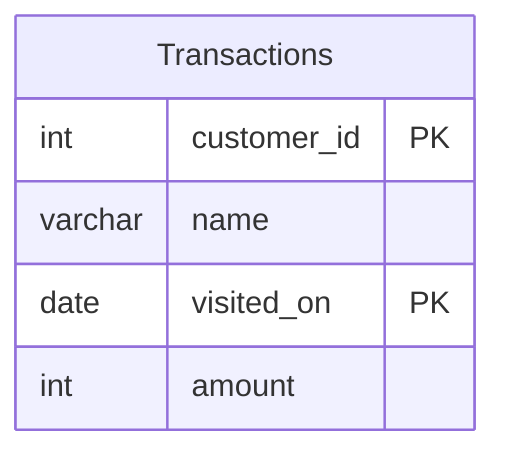

# [leetcode : 1321. Restaurant Growth](https://leetcode.com/problems/restaurant-growth/description/)

## **다이어그램**


## **목표**

> Write a solution to `compute the moving average of how much the customer paid in a seven-day window (i.e., current day + 6 days before). average_amount should be rounded to 2 decimal places.`
> `7일 이동평균과 이동합 구하기`

## **문제 풀이**

### **MySQL**

[tabs: Solution 1, Solution 2]

```sql
-- SOLUTION 1: ROWS BETWEEN
WITH sales_day AS (
    SELECT visited_on, SUM(amount) AS amount
    FROM customer
    GROUP BY visited_on
    ORDER BY visited_on
),
moving_avg AS (
    SELECT visited_on,
        ROUND(SUM(amount) OVER (ORDER BY visited_on ROWS BETWEEN 6 PRECEDING AND CURRENT ROW), 2) AS amount,
        ROUND(AVG(amount) OVER (ORDER BY visited_on ROWS BETWEEN 6 PRECEDING AND CURRENT ROW), 2) AS average_amount
    FROM sales_day
)
SELECT *
FROM moving_avg
WHERE visited_on >= (SELECT MIN(visited_on) + INTERVAL 6 DAY FROM moving_avg)
ORDER BY visited_on;
```

```sql
-- SOLUTION 2: RANGE BETWEEN + ROW_NUMBER
WITH TEMP AS (
    SELECT
        VISITED_ON,
        SUM(AMOUNT) OVER (ORDER BY VISITED_ON RANGE BETWEEN INTERVAL 6 DAY PRECEDING AND CURRENT ROW) AS AMOUNT,
        ROUND(AVG(AMOUNT) OVER (ORDER BY VISITED_ON RANGE BETWEEN INTERVAL 6 DAY PRECEDING AND CURRENT ROW),2) AS AVERAGE_AMOUNT,
        ROW_NUMBER() OVER (ORDER BY VISITED_ON) AS RN
    FROM (SELECT VISITED_ON, SUM(AMOUNT) AS AMOUNT FROM CUSTOMER GROUP BY VISITED_ON) SUB
)
SELECT VISITED_ON, AMOUNT, AVERAGE_AMOUNT
FROM TEMP
WHERE RN >= 7
```

[/tabs]

* SOLUTION 1
  * 일단 주어진 테이블이 정렬됐다는 보장이 없으므로, 날짜로 group by + order by를 진행한다.
  * 두 번째 CTE에서 이동평균, 이동합을 구해준다.
  * 세 번째로는 첫 날짜로 부터 6일이 흐른 시점부터 WINDOW를 적용 가능하므로 날짜 조건을 WHERE로 걸어준다.

* SOLUTION 2
  * 이동평균 구간합 구해주면서 rownum으로 번호까지 매기기

### **Pandas**

[tabs: Solution 1, Solution 2]

```python
# SOLUTION 1: rolling window
import pandas as pd

def restaurant_growth(customer: pd.DataFrame) -> pd.DataFrame:
    grouped = customer.groupby('visited_on').agg(
        sales_day = ('amount','sum')
    ).reset_index()
    grouped['amount'] = grouped['sales_day'].rolling(window=7).sum()
    grouped['average_amount'] = grouped['sales_day'].rolling(window=7).mean().round(2)
    return grouped.loc[~grouped['average_amount'].isnull(), ['visited_on','amount','average_amount']]
```

```python
# SOLUTION 2: rolling + rename
import pandas as pd

def restaurant_growth(customer: pd.DataFrame) -> pd.DataFrame:
    grouped = customer.groupby('visited_on').sum().reset_index()
    grouped = grouped.loc[:, ['visited_on','amount']].sort_values('visited_on')
    grouped['cumsum'] = grouped['amount'].rolling(window=7).sum().round(2)
    grouped['average_amount'] = grouped['amount'].rolling(window=7).mean().round(2)
    answer = grouped.loc[:, ['visited_on','cumsum','average_amount']]
    answer = answer.rename(columns={'cumsum':'amount'})
    return answer.loc[~(answer['average_amount'].isna()), ['visited_on','amount','average_amount']]
```

[/tabs]

* SOLUTION 1
  * rolling으로 window size 고정 시키는 메서드가 존재한다
  * groupby로 날짜 별 매출을 묶고, rolling + 집계함수를 통해서 문제풀이

* SOLUTION 2
  * rolling + 집계.
  * fillna, np.nan 등 통일성 맞추어서 isna쓰기.

## **코멘트**

* 윈도우 함수 기본