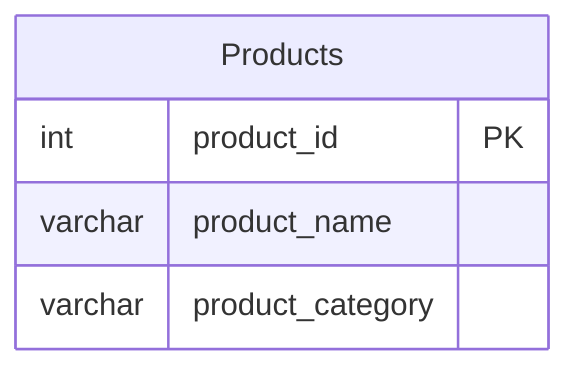

# [leetcode : 1327. List the Products Ordered in a Period](https://leetcode.com/problems/list-the-products-ordered-in-a-period/description/)

## **다이어그램**


## **목표**

> Write a solution to `get the names of products that have at least 100 units ordered in February 2020 and their amount.`
> `2020년 2월에 판매된 제품들 중, 매출이 100 이상인 제품의 이름과 매출 출력하기`

## **문제 풀이**

### **MySQL**

[tabs: Solution 1, Solution 2]

```sql
-- SOLUTION 1: CTE + HAVING
WITH feb_sales AS (
    SELECT *, SUM(unit) AS amount
    FROM orders
    WHERE order_date BETWEEN '2020-02-01' AND '2020-02-29'
    GROUP BY product_id
    HAVING SUM(unit) >= 100
)
SELECT p.product_name, f.amount AS unit
FROM feb_sales f
JOIN products p ON f.product_id = p.product_id
```

```sql
-- SOLUTION 2: CTE + HAVING
WITH FEB AS (
    SELECT PRODUCT_ID, SUM(UNIT) AS UNIT
    FROM ORDERS
    WHERE ORDER_DATE BETWEEN '2020-02-01' AND '2020-02-29'
    GROUP BY PRODUCT_ID
    HAVING SUM(UNIT) >= 100
)
SELECT P.PRODUCT_NAME, F.UNIT
FROM FEB F
JOIN PRODUCTS P ON P.PRODUCT_ID = F.PRODUCT_ID
```

[/tabs]

* SOLUTION 1, 2
  * CTE에 GROUP BY + HAVING을 통해서 2월의 orders table에서 제품별 합을 구한다.
  * join 통해서 제품이름 출력하기.
  * 실행 속도는 inner join이 훨씬 빠르다.

### **Pandas**

[tabs: Solution 1, Solution 2]

```python
# SOLUTION 1: strftime
import pandas as pd

def list_products(products: pd.DataFrame, orders: pd.DataFrame) -> pd.DataFrame:
    orders = orders.copy()
    orders['feb20'] = orders['order_date'].dt.strftime('%Y-%m') == '2020-02'
    grouped = orders[orders['feb20']==True].groupby('product_id').agg(
        unit = ('unit','sum')
    ).reset_index()

    answer = pd.merge(grouped[grouped['unit']>=100], products, on='product_id')
    return answer.loc[:, ['product_name','unit']]
```

```python
# SOLUTION 2: between
import pandas as pd

def list_products(products: pd.DataFrame, orders: pd.DataFrame) -> pd.DataFrame:
    grouped = (orders[orders['order_date'].between('2020-02-01','2020-02-29')]
        .groupby('product_id')
        .agg(unit = ('unit','sum'))
    ).reset_index()
    answer = pd.merge(products, grouped[grouped['unit']>=100], on='product_id')
    return answer.loc[:, ['product_name','unit']]
```

[/tabs]

* SOLUTION 1, 2
  * 날짜필터 걸어주고, group by + sum으로 그룹
  * grouped에서 100이 넘는 것 들 중에서 products와 join.
  * 날짜 필터를 걸어주는 방식에 strftime, between이 있는데 MySQL에서는 strftime처럼 다른 변수를 생성하면 인덱스가 걸려있는 경우 성능 차이가 굉장히 난다.
  * 대용량 데이터가 아니라서 쿼리 동작속도에 큰 차이는 없지만 between처럼 추가적인 연산이 필요 없는 방식으로 작성하기.

## **코멘트**

* 기본 문제
