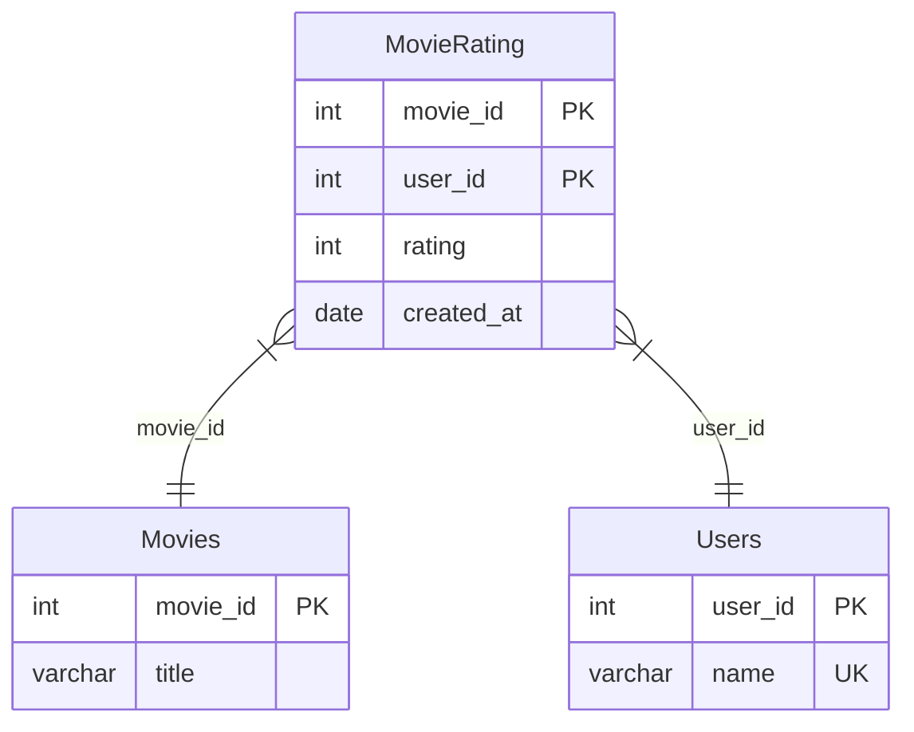

# [leetcode : 1341. Movie Rating](https://leetcode.com/problems/movie-rating/description/)

## **다이어그램**



## **목표**

> Write a solution to `find the name of the user who has rated the greatest number of movies. In case of a tie, return the lexicographically smaller user name.` And `find the movie name with the highest average rating in February 2020. In case of a tie, return the lexicographically smaller movie name.`
> `평점을 가장 많이 매긴 사람과 2020년 2월 평점이 가장 높은 영화 구하기`

## **문제 풀이**

### **MySQL**

[tabs: Solution 1, Solution 2]

```sql
-- SOLUTION 1: CTE + UNION ALL
WITH feb AS (
    SELECT *, AVG(rating) AS score
    FROM movierating
    WHERE LEFT(created_at,7) = '2020-02'
    GROUP BY movie_id
),
rated AS (
    SELECT *, COUNT(*) AS cnt
    FROM movierating
    GROUP BY user_id
),
name AS (
    SELECT name AS results
    FROM users u
    JOIN rated r ON r.user_id = u.user_id
    WHERE cnt = (SELECT MAX(cnt) FROM rated)
    ORDER BY name
    LIMIT 1
),
movie_name AS (
    SELECT m.title AS results
    FROM feb f
    JOIN movies m ON f.movie_id = m.movie_id
    WHERE score = (SELECT MAX(score) FROM feb)
    ORDER BY title
    LIMIT 1
)
SELECT * FROM name
UNION ALL
SELECT * FROM movie_name
```

```sql
-- SOLUTION 2: ROW_NUMBER + UNION ALL
WITH RATED_COUNT AS (
    SELECT
        U.NAME AS results,
        ROW_NUMBER() OVER (ORDER BY COUNT(*) DESC, U.NAME) AS RN
    FROM MOVIERATING MR
    JOIN USERS U ON U.USER_ID = MR.USER_ID
    GROUP BY MR.USER_ID, U.NAME
),
RATED_SCORE AS (
    SELECT M.TITLE AS results
    FROM MOVIERATING MR
    JOIN MOVIES M ON MR.MOVIE_ID = M.MOVIE_ID
    WHERE MR.CREATED_AT BETWEEN '2020-02-01' AND '2020-02-29'
    GROUP BY MR.MOVIE_ID
    ORDER BY AVG(RATING) DESC, M.TITLE
)
SELECT results
FROM RATED_COUNT
WHERE RN = 1
UNION ALL
SELECT results
FROM RATED_SCORE
LIMIT 2
```

[/tabs]

* SOLUTION 1
  * CTE에 결과를 마구마구 저장하기.
  * 평점같은 경우는 movie id로, 평점 매긴 사람은 user_id로 group by
  * 각 테이블에서 서브쿼리로 최대 평가 수, 최대 평점을 가진 것을 가져온다.
  * 컬럼명을 results로 맞춰주고 union all
  * test case 18에 이름/영화이름이 동일한 경우가 있어서 중복허용 안하면 사라진다.

* SOLUTION 2
  * ROW_NUMBER로 리뷰개수 1등을 가져온다.
  * SCORE 집계 함수 테이블과 UNION을 해주고, LIMIT 2 해주면 이름/영화 1등이 나온다.

### **Pandas**
[tabs: Solution 1, Solution 2]

```python
# SOLUTION 1: groupby + sort_values
import pandas as pd

def movie_rating(movies: pd.DataFrame, users: pd.DataFrame, movie_rating: pd.DataFrame) -> pd.DataFrame:
    user_grouped = movie_rating.groupby('user_id').agg(
        cnt = ('user_id','count')
    ).reset_index()

    avg_score = movie_rating[movie_rating['created_at'].between('2020-02-01','2020-02-29')].groupby('movie_id').agg(
        score = ('rating','mean')
    ).reset_index()
    
    max_name = pd.merge(user_grouped, users, on='user_id')
    max_movie = pd.merge(avg_score, movies, on='movie_id')
    max_name.sort_values(['cnt','name'], ascending=[False,True], inplace=True)
    max_movie.sort_values(['score','title'], ascending=[False,True], inplace=True)

    answer = pd.DataFrame({'results': [max_name['name'].values[0], max_movie['title'].values[0]]})
    return answer
```

```python
# SOLUTION 2: head 사용
import pandas as pd

def movie_rating(movies: pd.DataFrame, users: pd.DataFrame, movie_rating: pd.DataFrame) -> pd.DataFrame:
    rated_count = movie_rating.groupby('user_id').agg(
        cnt = ('user_id','size')
    ).reset_index()

    cond_feb = movie_rating['created_at'].between('2020-02-01','2020-02-29')
    rated_score = movie_rating[cond_feb].groupby('movie_id').agg(
        avg_score = ('rating','mean')
    ).reset_index()

    top_user = pd.merge(rated_count, users, on='user_id').sort_values(by=['cnt','name'], ascending=[False, True]).head(1)
    top_movie = pd.merge(rated_score, movies, on='movie_id').sort_values(by=['avg_score','title'], ascending=[False, True]).head(1)

    return pd.DataFrame({'results':[top_user['name'].values[0], top_movie['title'].values[0]]})
```

[/tabs]

* SOLUTION 1
  * 마찬가지로 groupby + agg로 집계하기.
  * merge를 통해 join해주고
  * sort_values에서 다중 조건으로 정렬하기

* SOLUTION 2
  * 비슷한 방식으로 풀이.
  * head로 맨 위 결과만 가져온다.
  * values에서 [0]을 안붙이면 np array라서 답은 같아보여도 오답으로 나온다.

## **코멘트**

* 기본 문제
