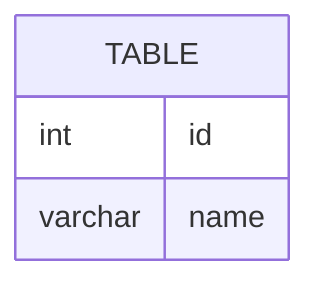

# [leetcode : 1378. Replace Employee ID With The Unique Identifier](https://leetcode.com/problems/replace-employee-id-with-the-unique-identifier/description/)

## **다이어그램**


## **목표**

> Write a solution to `show the unique ID of each user. If a user does not have a unique ID replace just show null.`
> `각 직원의 unique ID 구하기 (없으면 null)`

## **문제 풀이**

### **MySQL**

[tabs: Solution 1]

```sql
-- SOLUTION 1: LEFT JOIN
SELECT u.unique_id, e.name
FROM employees e
LEFT JOIN employeeUNI u ON e.id = u.id;
```

[/tabs]

* SOLUTION 1
  * 기본 left join 문제이다.
  * 행 수가 더 많은 emp테이블을 기준으로 emp uni와 left join을 해주면 된다.

### **Pandas**

[tabs: Solution 1]

```python
# SOLUTION 1: merge how='left'
import pandas as pd

def replace_employee_id(employees: pd.DataFrame, employee_uni: pd.DataFrame) -> pd.DataFrame:
    grouped = pd.merge(employees, employee_uni, on='id', how='left')
    return grouped.loc[:, ['unique_id','name']]
```

[/tabs]

* SOLUTION 1
  * pd.merge에 left join으로 조인
  * 공통 컬럼이 하나인 경우에는 굳이 on에 지정을 안해도 된다.
  * 웬만하면 가독성을 위해서 지정해주기.
  * 속도 면에서도 지정하는게 조금더 빠르다고 한다.

## **코멘트**

* 기본 문제
