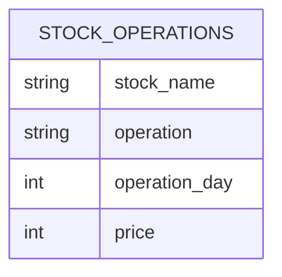

# [leetcode : 1393. Capital Gain/Loss](https://leetcode.com/problems/capital-gainloss/description/)

## **다이어그램**


## **목표**

> Write a solution to `report the Capital gain/loss for each stock. The Capital gain/loss of a stock is the sum of all Buy and Sell operations on that stock.`
> `각 주식별 총 gain/loss 구하기 (Buy는 음수, Sell은 양수)`

## **문제 풀이**

### **MySQL**

[tabs: Solution 1, Solution 2]

```sql
-- SOLUTION 1: SUM + IF
SELECT stock_name, SUM(IF(operation='Buy', -price, price)) AS capital_gain_loss
FROM stocks
GROUP BY stock_name
```

```sql
-- SOLUTION 2: CTE + IF
WITH TEMP AS (
    SELECT STOCK_NAME, IF(OPERATION='Buy',-PRICE,PRICE) AS FLOW
    FROM STOCKS
)
SELECT STOCK_NAME, SUM(FLOW) AS CAPITAL_GAIN_LOSS
FROM TEMP
GROUP BY STOCK_NAME
```

[/tabs]

* SOLUTION 1
  * 처음에는 group by로 주식별 buy sell 나누려고 했다.
  * 이러면 두 테이블 join시 null값을 처리해야해서 한 번에 sum if로 처리
  * 1등 코드랑 거의 똑같이 짰음~

* SOLUTION 2
  * CTE로 주식 이름이랑 현금 흐름만 IF로 +- 처리
  * GROUP BY + SUM으로 문제풀이.

### **Pandas**

[tabs: Solution 1]

```python
# SOLUTION 1: np.where + groupby
import pandas as pd
import numpy as np

def capital_gainloss(stocks: pd.DataFrame) -> pd.DataFrame:
    stocks = stocks.copy()
    stocks['capital_gain_loss'] = np.where(stocks['operation']=='Buy', -stocks['price'], stocks['price'])
    return stocks.groupby('stock_name')['capital_gain_loss'].sum().reset_index()
```

[/tabs]

* SOLUTION 1
  * 같은 방식으로 짠 코드.
  * sum if 대신 np.where로 조건걸어주기.
  * 예전이랑 같은 방식으로 문제 풀이.
  * 흐름이 긴 코드의 경우에는 agg + sum으로 풀지만, 간단한 경우에는 바로 groupby + sum을 사용

## **코멘트**

* 개인 레퍼런스 만들면서 보는중인데, 생각나는 부분은 확실히 빨라졌다.
