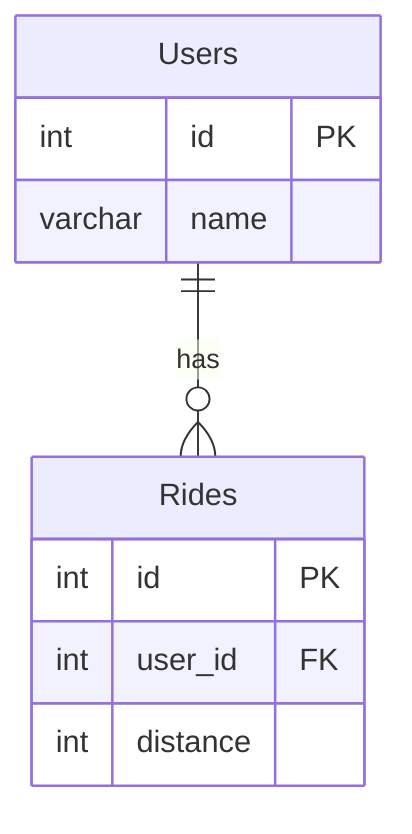

# [leetcode : 1407. Top Travellers](https://leetcode.com/problems/top-travellers/description/)

## **다이어그램**


## **목표**

> Write a solution to `report the distance travelled by each user. Return the result table ordered by travelled_distance in descending order, if two or more users travelled the same distance, order them by their name in ascending order.`
> `유저별 라이딩 거리 합계 구하기 (거리 내림차순, 이름 오름차순)`

## **문제 풀이**

### **MySQL**

[tabs: Solution 1, Solution 2]

```sql
-- SOLUTION 1: 서브쿼리 + LEFT JOIN
SELECT users.name, COALESCE(temp.dist,0) AS travelled_distance
FROM users
LEFT JOIN (
    SELECT *, SUM(distance) AS dist 
    FROM rides
    GROUP BY user_id
) AS temp
ON temp.user_id = users.id
ORDER BY temp.dist DESC, users.name
```

```sql
-- SOLUTION 2: CTE + LEFT JOIN
WITH GROUPED AS (
    SELECT USER_ID, SUM(`DISTANCE`) AS TRAVELLED_DISTANCE
    FROM RIDES
    GROUP BY USER_ID
)
SELECT U.NAME, COALESCE(G.TRAVELLED_DISTANCE,0) AS TRAVELLED_DISTANCE
FROM USERS U
LEFT JOIN GROUPED G ON G.USER_ID = U.ID
ORDER BY TRAVELLED_DISTANCE DESC, U.NAME ASC
```

[/tabs]

* SOLUTION 1
  * cte나 서브쿼리 쓰는게 조금 느리긴 한데 가독성 면이나 생각의 순서가 보여서 좀 더 편하다.
  * left join에서 발생하는 null값은 coalesce로 처리

* SOLUTION 2
  * CTE를 사용해서 유저 별 합계를 먼저 구한 후
  * LEFT JOIN하며 발생하는 NULL값을 COALESCE로 처리.
  * IFNULL도 되긴 하는데 표준 SQL로 쓰는게 좋은거같아서 COALESCE 사용

### **Pandas**

[tabs: Solution 1, Solution 2]

```python
# SOLUTION 1: merge how='right'
import pandas as pd

def top_travellers(users: pd.DataFrame, rides: pd.DataFrame) -> pd.DataFrame:
    grouped = rides.groupby('user_id').agg(
        travelled_distance = ('distance','sum')
    ).reset_index()
    joined = pd.merge(grouped, users, how='right', left_on='user_id', right_on='id')
    joined['travelled_distance'] = joined['travelled_distance'].fillna(0)
    joined.sort_values(['travelled_distance','name'], ascending=[False,True], inplace=True)
    return joined.loc[:, ['name','travelled_distance']]
```

```python
# SOLUTION 2: merge + sort_values
import pandas as pd

def top_travellers(users: pd.DataFrame, rides: pd.DataFrame) -> pd.DataFrame:
    grouped = rides.groupby('user_id').agg(
        travelled_distance = ('distance','sum')
    ).reset_index()
    joined = pd.merge(grouped, users, left_on='user_id', right_on='id', how='right')
    joined['travelled_distance'] = joined['travelled_distance'].fillna(0)
    return joined.loc[:, ['name','travelled_distance']].sort_values(by=['travelled_distance','name'], ascending=[False,True])
```

[/tabs]

* SOLUTION 1
  * agg로 컬럼명 바꾸면서 유저 별 합계 구한다.
  * 컬럼명이 다르니 left right on을 통해서 join
  * null값 처리는 fillna 후 정렬기준 맞춰서 출력

* SOLUTION 2
  * 비슷한 방식으로 풀이

## **코멘트**

* 기본 문제
