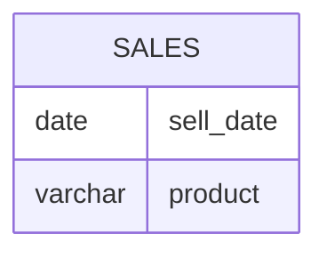

# [leetcode : 1484. Group Sold Products By The Date](https://leetcode.com/problems/group-sold-products-by-the-date/description/)

## **다이어그램**


## **목표**

> Write a solution to `find for each date the number of different products sold and their names. The sold products names for each date should be sorted lexicographically.`
> `각 날짜에 팔린 물건들 오름차순으로 정리해서 문자열 연결`

## **문제 풀이**

### **MySQL**

[tabs: Solution 1]

```sql
-- SOLUTION 1: GROUP_CONCAT
SELECT SELL_DATE,
    COUNT(DISTINCT(PRODUCT)) AS NUM_SOLD,
    GROUP_CONCAT(DISTINCT PRODUCT ORDER BY PRODUCT SEPARATOR ',') AS PRODUCTS
FROM ACTIVITIES
GROUP BY SELL_DATE;
```

[/tabs]

* SOLUTION 1
  * GROUP_CONCAT이란 함수가 있어서 사용해주면 된다.
  * GROUP_CONCAT(합칠 컬럼 정렬기준 SEPARATOR 구분자)

### **Pandas**

[tabs: Solution 1, Solution 2]

```python
# SOLUTION 1: groupby + lambda
import pandas as pd

def categorize_products(activities: pd.DataFrame) -> pd.DataFrame:
    grouped = activities.groupby('sell_date').agg(
        num_sold=('product', 'nunique'),
        products=('product', lambda x: ','.join(sorted(x.unique())))
    ).reset_index()
    return grouped
```

```python
# SOLUTION 2: defaultdict + iterrows
import pandas as pd
from collections import defaultdict

def categorize_products(activities: pd.DataFrame) -> pd.DataFrame:
    temp = defaultdict(set)
    for _, row in activities.iterrows():
        temp[row['sell_date']].add(row['product'])
    
    answer = pd.DataFrame({
        'sell_date': list(temp.keys()),
        'num_sold': [len(products) for products in temp.values()],
        'products': [','.join(sorted(products)) for products in temp.values()]
    })
    
    answer = answer.sort_values('sell_date').reset_index(drop=True)
    return answer
```

[/tabs]

* SOLUTION 1
  * products=('product', lambda x: ','.join(sorted(x.unique())))
  * 이 부분처럼 product 객체 모아놓고, lambda 함수 적용시켜서 반환하기.
  * 파이썬으로는 어려울게 없다.
  * groupby + lambda에서 sell_date가 같은 데이터프레임이 전해지고, 이 데이터프레임의 product에 접근한다.
  * x가 grouped[grouped['sell_date']==어떤 날짜]['product']이다.
  * 반환된 시리즈의 x.unique로 상품명에 접근 후 join으로 합쳐주기

* SOLUTION 2
  * for문으로 접근해서 풀기

## **코멘트**

* 기본 문제