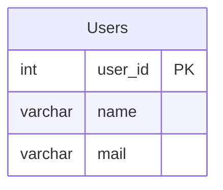

# [leetcode : 1517. Find Users With Valid E-Mails](https://leetcode.com/problems/find-users-with-valid-e-mails/description/)

## **다이어그램**



## **목표**

> Write a solution to `find the users who have valid emails.`
> A valid e-mail has a prefix name and a domain where:
> - The prefix name is a string that may contain letters (upper or lower case), digits, underscore '_', period '.', and/or dash '-'. The prefix name must start with a letter.
> - The domain is '@leetcode.com'.
> `패턴에 맞는 유효한 이메일 찾기 (알파벳으로 시작, @leetcode.com 도메인)`

## **문제 풀이**

* 문자열 조건 매칭을 보면 정규표현식 먼저 쓰는게 맞다.

### **MySQL**

[tabs: Solution 1]

```sql
-- SOLUTION 1: REGEXP
SELECT *
FROM USERS
WHERE MAIL REGEXP '^[A-Za-z][A-Za-z0-9._-]*@leetcode\\.com$'
```

[/tabs]

* SOLUTION 1
  * `^`가 시작, `$`가 끝, [A-Za-z]는 알파벳, [0-9]는 숫자
  * @ 기준으로 split으로 찢는 시도도 해봤는데, 애초에 문자열이 prefix, domain으로 구분되지 않은 경우도 있어서 이는 패스.

### **Pandas**

[tabs: Solution 1]

```python
# SOLUTION 1: str.match
import pandas as pd

def valid_emails(users: pd.DataFrame) -> pd.DataFrame:
    return users[users['mail'].str.match(r'^[a-zA-Z][A-Za-z0-9._-]*@leetcode\.com$')]
```

[/tabs]

* SOLUTION 1
  * 마찬가지로 정규표현식 사용
  * 파이썬에서는 raw string을 지정해주는 r이 있어서 \\을 사용하지 않고 r이랑 같이 사용할 수 있다.

## **코멘트**

* 저런 패턴 매칭할 때 \w같은거를 쓰면 시간이 더 줄어들긴 한다.
* 일단 기본적으로 사용하는 방법만 익혀두기
