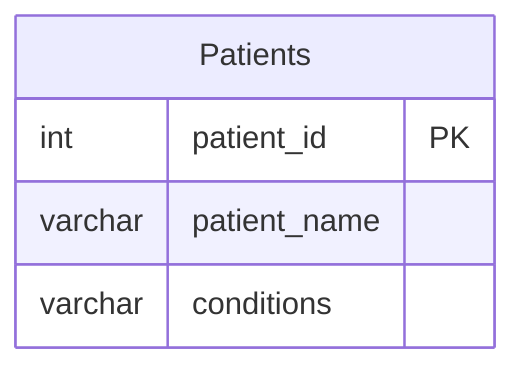

# [leetcode : 1527. Patients With a Condition](https://leetcode.com/problems/patients-with-a-condition/description/)

## **다이어그램**



## **목표**

> Write a solution to `find the patient_id, patient_name, and conditions of the patients who have Type I Diabetes. Type I Diabetes always starts with DIAB1 prefix.`
> `DIAB1로 시작하는 conditions 찾기`

## **문제 풀이**

### **MySQL**

[tabs: Solution 1]

```sql
-- SOLUTION 1: REGEXP + boundary
SELECT *
FROM patients
WHERE conditions REGEXP '\\bDIAB1'
```

[/tabs]

* SOLUTION 1
  * 문자열을 보고 like로 접근할 수 도 있는데, DIAB1 앞에 다른 접두어가 붙어있는 경우가 있다.
  * 이러한 경우에는 단독 매칭을 시켜주는 boundary를 사용해야 한다고 한다.

### **Pandas**

[tabs: Solution 1]

```python
# SOLUTION 1: str.contains + boundary
import pandas as pd

def find_patients(patients: pd.DataFrame) -> pd.DataFrame:
    return patients[patients['conditions'].str.contains('\\bDIAB1')]
    # return patients[patients['conditions'].str.contains(r'\bDIAB1')]
```

[/tabs]

* SOLUTION 1
  * 마찬가지로 boundary 지정 \b를 통해서 풀이.
  * 파이썬에서는 raw string을 지정해주는 r이 있어서 \\을 사용하지 않고 r이랑 같이 사용할 수 있다.
  * raw string 지정하면, 내부 타입에서 바뀌는게 있어서 그런가 시간이 더 느리게 나왔다

## **코멘트**

* 정규표현식 날 잡고 한 번 정리 해야할듯....
